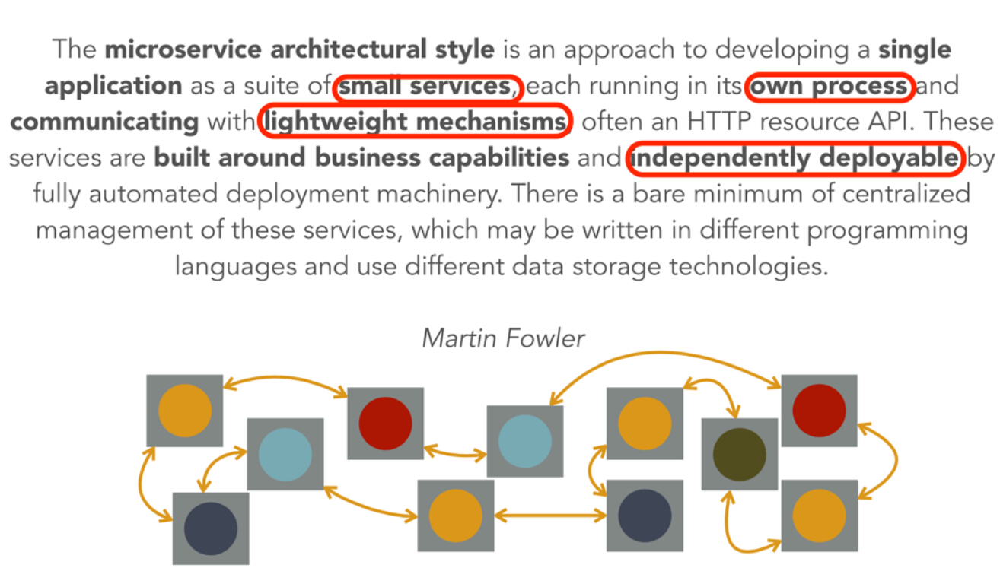
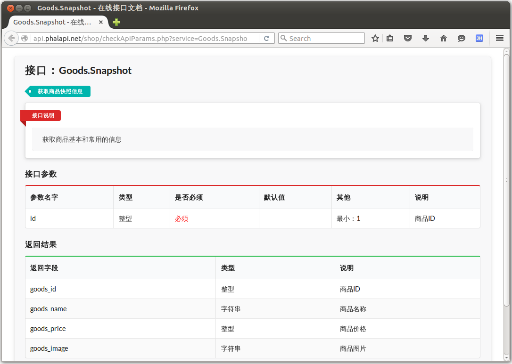
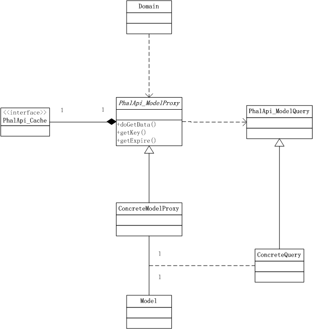
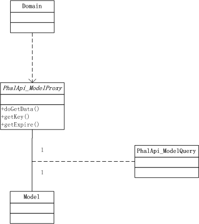
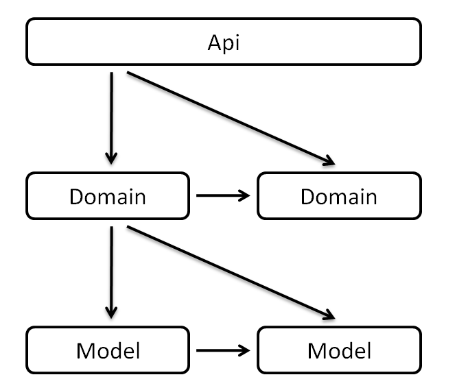
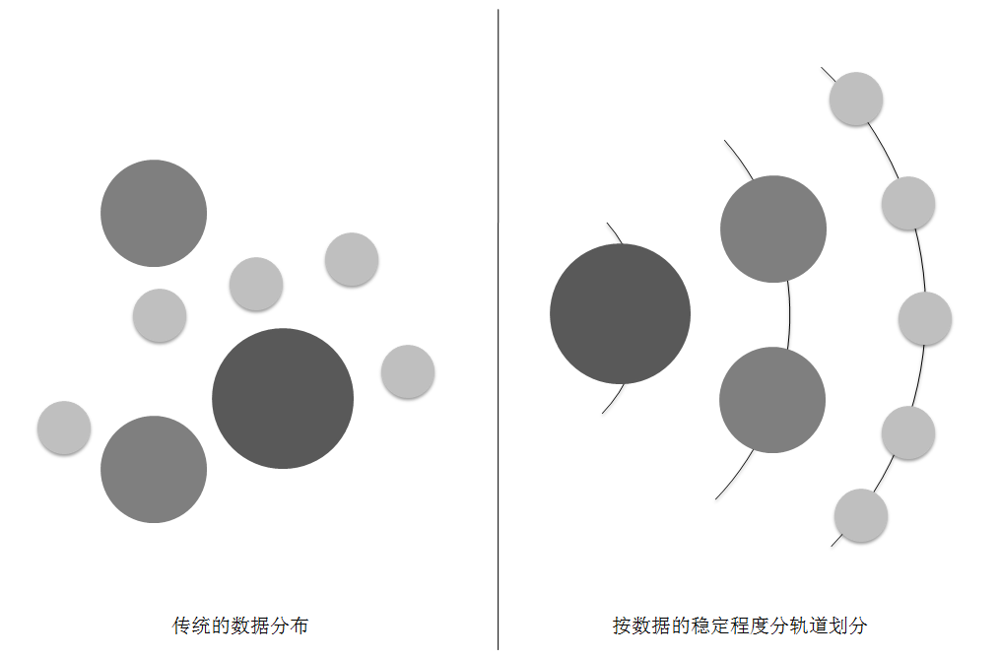
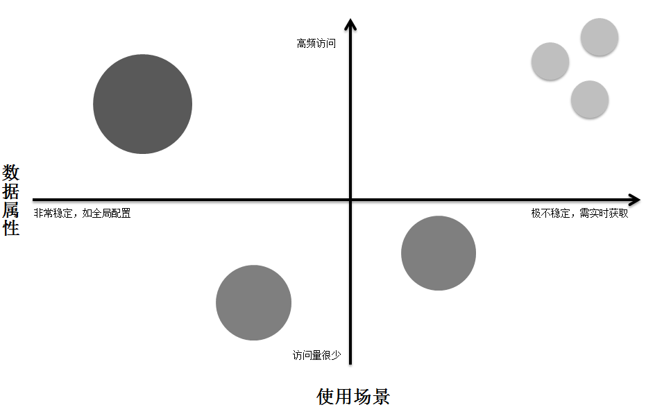
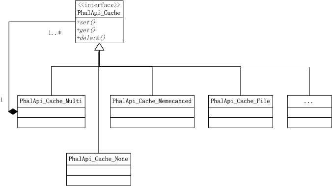

# 第2章 基础入门  

__我发现，我越是努力，就越发幸运。——Thomas Jefferson__  
  
娴熟的技艺离不开过硬扎实的基础。这一章，我们将开始学习PhalApi框架中的基础内容，包括作为客户端如何请求接口服务，作为服务端如何返回接口结果，ADM模式的含义和依赖关系，以及其他常用的基础功能。为避免内容空洞，我们会尽量结合前面的商城项目示例，进行基础内容的讲解。读者可以在边学习的过程中，边实践操作，加深理解。  

在每个小节中，我们会先学习一些基本的使用，以便能满足普遍项目开发的技术需要。对于容易误解、容易出错的地方，我们会进行温馨提示，列出注意事项以及提供正确的解决方案。在每个小节的最后，我们还会再进一步，学习如何扩展项目的能力，定制自己的功能。  

## 2.1 接口请求

PhalApi默认使用的是HTTP/HTTPS协议进行通讯，请求接口的完整URL格式则是：  
```
接口域名 + 入口路径 + ?service=Class.Action + [接口参数]
```
其中有应该单独部署的接口域名，不同项目各自的入口路径，统一约定的service参数，以及可选的接口参数。下面分别进行说明。  

### 2.1.1 接口服务URI

#### (1) 接口域名

通常，我们建议对于接口服务系统，应该单独部署一个接口域名，而不应与其他传统的Web应用系统或者管理后台混合在一起，以便分开维护。  
  
假设我们已经有一个站点，其域名为：```www.demo.com```，现需要为开发一套接口服务提供给移动App使用。直接在已有站点下添加一个入口以提供服务的做法是不推荐的，即不建议接口URI是：```www.demo.com/api```。推荐的做法是，单独配置部署一个新的接口域名，如：```api.demo.com```。当前，我们也可以发现很多公司都提供了这样独立的接口平台。例如：  

 + 优酷开放平台：https://openapi.youku.com
 + 微信公众号： https://api.weixin.qq.com
 + 新浪微博： https://api.weibo.com

  
如第1章中，我们创建的接口项目，其域名为：```api.phalapi.net```。  

#### (2) 入口路径  
入口路径是相对路径，不同的项目可以使用不同的入口。通常在这里，我们会在部署接口项目时，会把项目对外可访问的根目录设置到```./Public```目录。这里所说的入口路径都是相对这个```./Public```目录而言的。与此同时，默认使用省略```index.php```的路径写法。  
  
为了更好地理解这样的对应关系，以下是一些示例对应关系。  

项目|精简的入口路径|完整的入口路径|入口文件位置|项目源代码位置
---|---|---|---|---
默认的演示项目|/demo|/Public/demo/index.php|./Public/demo/index.php|./Demo
新建的商城项目|/shop|/Public/shop/index.php|./Public/shop/index.php|./Shop

表2-1 入口路径示例对应关系

如框架自带的演示项目，其目录是：```./Public/demo```，对应的访问入口路径是：```api.phalapi.net/demo```；而新建的商城Shop项目的目录是：```./Public/shop```，则入口路径是：```api.phalapi.net/shop```。  

这个入口路径是可选的，也可以直接使用根目录。如果是这样，则需要调整```./Public/index.php```目录，并且不便于多项目并存的情况。    

#### (3) 指定接口服务
在PhalApi中，我们统一约定使用```service```参数来指定所请求的接口服务。通常情况下，此参数使用GET方式传递，即使用```$_GET['service']```，其格式为：```?service=Class.Action```。其中```Class```是对应请求的接口剔除Api_前缀后的类名，```Action```则是待执行的接口类中的方法名。

> 温馨提示：未指定service参数时，默认使用```?service=Default.Index```。  
  
如请求默认的接口服务可用```?service=Default.Index```，则相应会调用```Api_Default::Index()```这一接口服务；若请求的是```?service=Welcome.Say```，则会调用```Api_Welcome::Say```这一接口服务。  
  
以下是一些示例。  

 + 请求默认接口服务，省略service
```
http://api.phalapi.net/shop/  
```

 + 等效于请求默认接口服务
```
http://api.phalapi.net/shop/?service=Default.Index  
```
  
 + 请求Hello World接口服务
```
http://api.phalapi.net/shop/?service=Welcome.Say
```

#### (4) 接口参数  
接口参数是可选的，根据不同的接口服务所约定的参数进行传递。可以是GET参数，POST参数，或者多媒体数据。未定制的情况下，PhalApi既支持GET参数又支持POST参数。   

如使用GET方式传递username参数：
```
$ curl "http://api.phalapi.net/shop/?service=Default.Index&username=dogstar"
```
也可以用POST方式传递username参数：
```
$ curl -d "username=dogstar" "http://api.phalapi.net/shop/?service=Default.Index"
```

至此，我们已经基本了解如何对接口服务发起请求。接下来，让我们来看下对于接口服务至关重要的要素 —— 接口参数。    

### 2.1.2 参数规则
接口参数，对于接口服务本身来说，是非常重要的。对于外部调用的客户端来说，同等重要。对于接口参数，我们希望能够既减轻后台开发对接口参数获取、判断、验证、文档编写的痛苦；又能方便客户端快速调用，明确参数的意义。由此，我们引入了**参数规则**这一概念，即：通过配置参数的规则，自动实现对参数的获取和验证，同时自动生成在线接口文档。  
  
参数规则是针对各个接口服务而配置的多维规则数组，由```PhalApi_Api::getRules()```方法返回。其中，参数规则数组的一维下标是接口类的方法名，对应接口服务的Action；二维下标是类属性名称，对应在服务端获取通过验证和转换化的最终客户端参数；三维下标```name```是接口参数名称，对应外部客户端请求时需要提供的参数名称。即：  
```
    public function getRules() {
        return array(
            '接口类方法名' => array(
                '接口类属性' => array('name' => '接口参数名称', ... ... ),
            ),
        );
    }
```  

通常情况下，接口类属性和接口参数名称一样，但也可以不一样。一种情况是客户端的接口参数名称惯用下划线分割，即蛇形(下划线)命名法，而服务端中则惯用驼峰命名法。例如对于“是否记住我”，客户端参数用```is_remember_me```，服务端用```isRememberMe```。另一种情况是如果参数名称较长，为了节省移动网络下的流量，也可以针对客户端参数使用有意义的缩写。如前面的“是否记住我”客户端缩写成```is_rem_me```。   
  
在参数规则里，可以配置多个接口类方法名，每个方法名的规则，又可以配置多个接口类属性，即有多个接口参数。  
  
配置好参数规则后，当接口参数通过验证后，就可以在接口类方法内，通过类成员属性获取相应的接口参数。  

#### (1) 一个简单的示例
假设我们现在需要提供一个用户登录的接口，接口参数有用户名和密码，那么新增的接口类和规则如下：  
```
// $ vim ./Shop/Api/User.php
<?php

class Api_User extends PhalApi_Api {

    public function getRules() {
        return array(
            'login' => array(
                'username' => array('name' => 'username'),
                'password' => array('name' => 'password'),
            ),
        );
    }

    public function login() {
        return array('username' => $this->username, 'password' => $this->password);
    }                               
}
```

当我们请求此接口服务，并类似这样带上username和password参数时：  
```
http://api.phalapi.net/shop/?service=User.Login&username=dogstar&password=123456
```
就可以得到这样的返回结果。  
```
{"ret":0,"data":{"username":"dogstar","password":"123456"},"msg":""}
```

这是因为，在接口实现类里面```getRules()```成员方法配置参数规则后，便可以通过类属性的方式，根据配置指定的名称获取对应的接口参数，如这里的：```$this->username```和```$this->password```。  

#### (2) 更完善的示例
在实际项目开发中，我们需要对接口参数有更细致的规定，如是否必须、长度范围、最值和默认值等。 

继续上面的业务场景，用户登录接口服务的用户名参数和密码参数皆为必须，且密码长度至少为6个字符，则可以参数规则调整为：  
```
'login' => array(
   'username' => array('name' => 'username', 'require' => true),
   'password' => array('name' => 'password', 'require' => true, 'min' => 6),
),
```
配置好后，如果不带任何参数再次请求```?service=User.Login```，就会被视为非法请求，并得到这样的错误提示：  
```
{
    "ret": 400,
    "data": [],
    "msg": "非法请求：缺少必要参数username"
}
```
如果传递的密码长度不对，也会得到一个错误的返回。  
> 温馨提示：当接口参数非法时，返回的ret都为400，且data为空。在这一章节中，当再次非法返回时，将省略ret与data，以节省篇幅。

#### (3) 三级参数规则配置
参数规则主要有三种，分别是：系统参数规则、应用参数规则、接口参数规则。  

系统参数是指被框架保留使用的参数。目前已被PhalApi占用的系统参数只有一个，即：service参数。类型为字符串，格式为：Class.Action，首字母不区分大小写，建议统一以大写开头。  

以下是一些示例： 

 + 推荐写法，类名和方法名开头大写
```
?service=User.Login
```

 + 正确写法，类名和方法名开头都小写，或方法名全部小写
```
?service=user.login
?service=user.getbaseinfo
```

 + 错误写法，缺少方法名、缺少点号分割、使用竖线而非点号分割
```
?service=User
?service=UserLogin
?service=User|GetBaseInfo
```

> 温馨提示：service参数中的类名只能开头小写，否则会导致linux系统下类文件加载失败。 

应用参数是指在一个接口系统中，全部项目的全部接口都需要的参数，或者通用的参数。假如我们的商城接口系统中全部的接口服务都需要必须的签名sign参数，以及非必须的版本号，则可以在```./Config/app.php```中的```apiCommonRules```进行应用参数规则的配置：  
```
//$vim ./Config/app.php
<?php
return array(
    /**
     * 应用接口层的统一参数
     */
    'apiCommonRules' => array(
        //签名
        'sign' => array(
            'name' => 'sign', 'require' => true,
        ),
        //客户端App版本号，默认为：1.4.0
        'version' => array(
            'name' => 'version', 'default' => '1.4.0', 
        ),
    ),

    ... ...
```
其配置格式和前面所说的接口参数规则配置类似，都是一个规则数组。区别是这里是二维数组，相当于全部方法的公共的接口类属性。    

接口参数是指各个具体的接口服务所需要的参数，为特定的接口服务所持有，独立配置。并且进一步在内部又细分为两种：  

 + **通用接口参数规则**：使用```*```作为下标，对当前接口类全部的方法有效。  
 + **指定接口参数规则**：使用方法名作为下标，只对接口类的特定某个方法有效。  


例如为了加强安全性，需要为全部的用户接口服务都加上长度为4位的验证码参数：  
```
    public function getRules() {
        return array(
            '*' => array(
                'code' => array('name' => 'code', 'require' => true, 'min' => 4, 'max' => 4),
            ),
            'login' => array(
                'username' => array('name' => 'username', 'require' => true),
                'password' => array('name' => 'password', 'require' => true, 'min' => 6),
            ),
        );
    }
```
现在，当再次请求用户登录接口，除了要提供用户名和密码外，我们还要提供验证码code参数。并且，对于Api_User类的其他方法也一样。  

#### (4) 多个参数规则时的优先级
当同一个参数规则分别在应用参数、通用接口参数及指定接口参数出现时，后面的规则会覆盖前面的，即具体化的规则会替换通用的规则，以保证接口参数满足特定场合的定制要求。  

简而言之，多个参数规则的优先级从高到下，分别是（正如你想到的那样）： 
  
 + 1、指定接口参数规则
 + 2、通用接口参数规则
 + 3、应用参数规则
 + 4、系统参数规则（通常忽略，当前只有service）

#### (5) 参数规则配置
具体的参数规则，根据不同的类型有不同的配置选项，以及一些公共的配置选项。目前，主要的类型有：字符串、整数、浮点数、布尔值、时间戳/日期、数组、枚举类型、文件上传和回调函数。    

类型 type|参数名称 name|是否必须 require|默认值 default|最小值 min，最大值 max|更多配置选项（无特殊说明，均为可选）
---|---|---|---|---|---
字符串|string|TRUE/FALSE，默认FALSE|应为字符串|可选|regex选项用于配置正则匹配的规则；format选项用于定义字符编码的类型，如utf8、gbk、gb2312等
整数|int|TRUE/FALSE，默认FALSE|应为整数|可选|---
浮点数|float|TRUE/FALSE，默认FALSE|应为浮点数|可选|---
布尔值|boolean|TRUE/FALSE，默认FALSE|true/false|---|以下值会转换为TRUE：ok，true，success，on，yes，1，以及其他PHP作为TRUE的值
时间戳/日期|date|TRUE/FALSE，默认FALSE|日期字符串|可选，仅当为format配置为timestamp时才判断，且最值应为时间戳|format选项用于配置格式，为timestamp时会将字符串的日期转换为时间戳
数组|array|TRUE/FALSE，默认FALSE|字符串或者数组，为非数组会自动转换/解析成数组|可选，判断数组元素个数|format选项用于配置数组和格式，为explode时根据separator选项将字符串分割成数组, 为json时进行JSON解析
枚举|enum|TRUE/FALSE，默认FALSE|应为range选项中的某个元素|---|必须的range选项，为一数组，用于指定枚举的集合
文件|file|TRUE/FALSE，默认FALSE|数组类型|可选，用于表示文件大小范围，单位为B|range选项用于指定可允许上传的文件类型；ext选项用于表示需要过滤的文件扩展名
回调|callable/callback|TRUE/FALSE，默认FALSE|---|---|callable/callback选项用于设置回调函数，params选项为回调函数的第三个参数（另外第一个为参数值，第二个为所配置的规则）  

表2-2 参数规则选项一览表  

##### 公共配置选项

公共的配置选项，除了上面的类型、参数名称、是否必须、默认值，还有说明描述、数据来源。下面分别简单说明。  
 
 + **类型 type**  
 用于指定参数的类型，可以是string、int、float、boolean、date、array、enum、file、callable，或者自定义的类型。未指定时，默认为字符串。  
  
 + **参数名称 name**  
 接口参数名称，即客户端需要传递的参数名称。与PHP变量规则一样，以下划线或字母开头。此选项必须提供，否则会提示错误。   
  
 + **是否必须require**  
 为TRUE时，表示此参数为必须值；为FALSE时，表示此参数为可选。未指定时，默认为FALSE。  
  
 + **默认值 default**  
 未提供接口参数时的默认值。未指定时，默认为NULL。  
  
 + **最小值 min，最大值 max**  
 部分类型适用。用于指定接口参数的范围，比较时采用的是闭区间，即范围应该为：[min, max]。也可以只使用min或max，若只配置了min，则表示：[min, +∞)；若只配置了maz，则表示：(-∞, max]。   

 + **说明描述 desc**  
 用于自动生成在线接口详情文档，对参数的含义和要求进行扼要说明。未指定时，默认为空字符串。  
  
 + **数据来源 source**  
 指定当前单个参数的数据来源，可以是post、get、cookie、server、request、header、或其他自定义来源。未指定时，默认为统一数据源。目前支持的source与对应的数据源映射关系如下：  

source|对应的数据源  
---|---
post     | $_POST              
get      | $_GET               
cookie   | $_COOKIE            
server   | $_SERVER            
request  | $_REQUEST           
header   | $_SERVER['HTTP_X']  

表2-3 source与对应的数据源映射关系  
  
通过source参数可以轻松、更自由获取不同来源的参数。以下是一些常用的配置示例。  
```
// 获取HTTP请求方法，判断是POST还是GET
'method' => array('name' => 'REQUEST_METHOD', 'source' => 'server'),

// 获取COOKIE中的标识
'is_new_user' => array('name' => 'is_new_user', 'source' => 'cookie'),

// 获取HTTP头部中的编码，判断是否为utf-8
'charset' => array('name' => 'Accept-Charset', 'source' => 'header'),
```

若配置的source为无效或非法时，则会抛出异常。如配置了```'source' => 'NOT_FOUND'```，会得到：     
```
"msg": "服务器运行错误: 参数规则中未知的数据源：NOT_FOUND"
```

##### 9种参数类型

对于各种参数类型，结合示例说明如下。  

 + **字符串 string**  

当一个参数规则未指定类型时，默认为string。如最简单的：  
```
array('name' => 'username')
```
> 温馨提示：这一小节的参数规则配置示例，都省略了类属性，以关注配置本身的内容。  

这样就配置了一个参数规则，接口参数名字叫username，类型为字符串。  

一个完整的写法可以为：
```
array('name' => 'username', 'type' => 'string', 'require' => true, 'default' => 'nobody', 'min' => 1, 'max' => 10)
```
这里指定了为必选参数，默认值为nobody，且最小长度为1个字符，最大长度为10个字符，若传递的参数长度过长，如```&username=alonglonglonglongname```，则会异常失败返回：
```
"msg": "非法请求：username.len应该小于等于10, 但现在username.len = 21"
```
  

当需要验证的是中文的话，由于一个中文字符会占用3个字节。所以在min和max验证的时候会出现一些问题。为此，PhalApi提供了format配置选项，用于指定字符集。如：  

```
array('name' => 'username', 'type' => 'string', 'format' => 'utf8', 'min' => 1, 'max' => 10)
```
  
我们还可以使用```regex```下标来进行正则表达式的验证，一个邮箱的例子是：  
```
array('name' => 'email', 'regex' => "/^([0-9A-Za-z\\-_\\.]+)@([0-9a-z]+\\.[a-z]{2,3}(\\.[a-z]{2})?)$/i")
```

 + **整型 int**  

整型即自然数，包括正数、0和负数。如通常数据库中的id，即可配置成：  
```
array('name' => 'id', 'type' => 'int', 'require' => true, 'min' => 1)
```

当传递的参数，不在其配置的范围内时，如```&id=0```，则会异常失败返回：
```
"msg": "非法请求：id应该大于或等于1, 但现在id = 0"
```

另外，对于常见的分页参数，可以这样配置：  
```
array('name' => 'page_num', 'type' => 'int', 'min' => 1, 'max' => 20, 'default' => 20)
```
即每页数量最小1个，最大20个，默认20个。  


 + **浮点 float**  

浮点型，类似整型的配置，此处略。 

 + **布尔值 boolean**  

布尔值，主要是可以对一些字符串转换成布尔值，如ok，true，success，on，yes，以及会被PHP解析成true的字符串，都会转换成TRUE。如通常的“是否记住我”参数，可配置成：
```
array('name' => 'is_remember_me', 'type' => 'boolean', 'default' => TRUE)
```
  
则以下参数，最终服务端会作为TRUE接收。  
```
?is_remember_me=ok
?is_remember_me=true
?is_remember_me=success
?is_remember_me=on
?is_remember_me=yes
?is_remember_me=1
```

 + **日期 date**  

日期可以按自己约定的格式传递，默认是作为字符串，此时不支持范围检测。例如配置注册时间：
```
array('name' => 'register_date', 'type' => 'date')
```
对应地，```register_date=2015-01-31 10:00:00```则会被获取到为："2015-01-31 10:00:00"。
  
当需要将字符串的日期转换成时间戳时，可追加配置选项```'format' => 'timestamp'```，则配置成：
```
array('name' => 'register_date', 'type' => 'date', 'format' => 'timestamp')
```
则上面的参数再请求时，则会被转换成：1422669600。  

此时作为时间戳，还可以添加范围检测，如限制时间范围在31号当天：  
```
array('name' => 'register_date', 'type' => 'date', 'format' => 'timestamp', 'min' =>  1422633600, 'max' => 1422719999)
```

当配置的最小值或最大值为字符串的日期时，会自动先转换成时间戳再进行检测比较。如可以配置成：  
```
array('name' => 'register_date', ... ... 'min' => '2015-01-31 00:00:00', 'max' => '2015-01-31 23:59:59')
```

 + **数组 array**  

很多时候在接口进行批量获取时，都需要提供一组参数，如多个ID，多个选项。这时可以使用数组来进行配置。如：  
```
array('name' => 'uids', 'type' => 'array', 'format' => 'explode', 'separator' => ',')
```

这时接口参数```&uids=1,2,3```则会被转换成：  
```
array ( 0 => '1', 1 => '2', 2 => '3', )
```

如果设置了默认值，那么默认值会从字符串，根据相应的format格式进行自动转换。如：  
```
array( ... ... 'default' => '4,5,6')
```
那么在未传参数的情况下，自动会得到：  
```
array ( 0 => '4', 1 => '5', 2 => '6', )
```

又如接口需要使用JSON来传递整块参数时，可以这样配置：
```
array('name' => 'params', 'type' => 'array', 'format' => 'json')
```
对应地，接口参数```&params={"username":"test","password":"123456"}```则会被转换成：
```
array ( 'username' => 'test', 'password' => '123456', )
```
> 温馨提示：使用JSON传递参数时，建议使用POST方式传递。若使用GET方式，须注意参数长度不应超过浏览器最大限制长度，以及URL编码问。  

若使用JSON格式时，设置了默认值为：  
```
array( ... ... 'default' => '{"username":"dogstar","password":"xxxxxx"}')
```
那么在未传参数的情况下，会得到转换后的：  
```
array ( 'username' => 'dogstar', 'password' => 'xxxxxx', )
```

特别地，当配置成了数组却未指定格式format时，接口参数会转换成只有一个元素的数组，如接口参数：```&name=test```，会转换成：
```
array ( 0 => 'test' )
```


 + **枚举 enum**  

在需要对接口参数进行范围限制时，可以使用此枚举型。如对于性别的参数，可以这样配置：
```
array('name' => 'sex', 'type' => 'enum', 'range' => array('female', 'male'))
```
当传递的参数不合法时，如```&sex=unknow```，则会被拦截，返回失败：
```
"msg": "非法请求：参数sex应该为：female/male，但现在sex = unknow"
```
  
关于枚举类型的配置，这里需要特别注意配置时，应尽量使用字符串的值。  
因为通常而言，接口通过GET/POST方式获取到的参数都是字符串的，而如果配置规则时指定范围用了整型，会导致底层规则验证时误判。例如接口参数为```&type=N```，而接口参数规则为：  
```
array('name' => 'type', 'type' => 'enum', 'range' => array(0, 1, 2))
```
则会出现以下这样的误判：  
```  
var_dump(in_array('N', array(0, 1, 2))); // 结果为true，因为 'N' == 0
```  
  
为了避免这类情况发生，应该使用使用字符串配置范围值，即可这样配置：  
```
array('name' => '&type', 'type' => 'enum', 'range' => array(`0`, `1`, `2`))
```
  
 + **文件 file**  

在需要对上传的文件进行过滤、接收和处理时，可以使用文件类型，如：
```
array(
    'name' => 'upfile', 
    'type' => 'file', 
    'min' => 0, 
    'max' => 1024 * 1024, 
    'range' => array('image/jpeg', 'image/png') , 
    'ext' => array('jpeg', 'png')
)
```
其中，min和max分别对应文件大小的范围，单位为字节；range为允许的文件类型，使用数组配置，且不区分大小写。 
  
如果成功，返回的值对应的是```$_FILES["upfile"]```，即会返回：
```
array(
     'name' => ..., // 被上传文件的名称
     'type' => ..., // 被上传文件的类型
     'size' => ..., // 被上传文件的大小，以字节计
     'tmp_name' => ..., // 存储在服务器的文件的临时副本的名称
)
```
对应的是：  
 + $_FILES["upfile"]["name"] - 被上传文件的名称
 + $_FILES["upfile"]["type"] - 被上传文件的类型
 + $_FILES["upfile"]["size"] - 被上传文件的大小，以字节计
 + $_FILES["upfile"]["tmp_name"] - 存储在服务器的文件的临时副本的名称
 + $_FILES["upfile"]["error"] - 由文件上传导致的错误代码
  
> 参考：以上内容来自W3School，文件上传时请使用表单上传，并enctype 属性使用"multipart/form-data"。更多请参考[PHP 文件上传](http://www.w3school.com.cn/php/php_file_upload.asp)。  

若需要配置默认值default选项，则也应为一数组，且其格式应类似如上。

其中，ext是对文件后缀名进行验证，当如果上传文件后缀名不匹配时将抛出异常。文件扩展名的过滤可以类似这样进行配置：

+ 单个后缀名 - 数组形式  
```
'ext' => array('jpg')
```

 + 单个后缀名 - 字符串形式  
```
'ext' => 'jpg'
```

 + 多个后缀名 - 数组形式  
```
'ext' => array('jpg', 'jpeg', 'png', 'bmp')
```

 + 多个后缀名 - 字符串形式（以英文逗号分割）  

```
'ext' => 'jpg,jpeg,png,bmp' 
```

  
 + **回调 callable/callback**  

当需要利用已有函数进行自定义验证时，可采用回调参数规则，如配置规则：  

```
array('name' => 'version', 'type' => 'callable', 'callback' => 'Common_Request_Version::formatVersion')
```
然后，回调时将调用下面这个新增的类函数：
```
// $ vim ./Shop/Common/Request/Version.php
<?php
class Common_Request_Version {

    public static function formatVersion($value, $rule) {
        if (count(explode('.', $value)) < 3) {
            throw new PhalApi_Exception_BadRequest('版本号格式错误');
        }
        return $value;
    }
}
```

> 温馨提示：回调函数的签名为：```function format($value, $rule, $params)```，第一个为参数原始值，第二个为所配置的规则，第三个可选参数为配置规则中的params选项。最后应返回转换后的参数值。  
  
还记得我们前面刚学的三级参数规则吗？虽然在应用参数配置中已配置公共version参数规则，但我们可以在具体的接口类中重新配置这个规则。把在Hello World接口中把这个版本参数类型修改成此自定义回调类型。即：  
```
// $ vim ./Shop/Api/Welcome.php     
class Api_Welcome extends PhalApi_Api {

    public function getRules() {
        return array(
            'say' => array(
                'version' => array('name' => 'version', 'type' => 'callable', 'callback' => 'Common_Request_Version::formatVersion'),
            )
        );
    }
... ...
```
修改好后，便可使用此自定义的回调处理了。当正常传递合法version参数，如请求```/shop/welcome/say?version=1.2.3```，可以正常响应。若故意传递非法的version参数，如请求```/shop/welcome/say?version=123```，则会提示这样的错误：  
```
"msg": "非法请求：版本号格式错误"
```
  
由于自 PHP 5.4 起可用callable类型指定回调类型callback。所以，为了减轻记忆的负担，这里使用callable或者callback来表示类型都可以，即可以配置成：```'type' => 'callable',```，也可以配置成：```'type' => 'callback',```。回调函数的选项也一样。  

  
以下是来自PHP官网的一些回调函数的示例：  
```
// Type 1: Simple callback
call_user_func('my_callback_function'); 

// Type 2: Static class method call
call_user_func(array('MyClass', 'myCallbackMethod')); 

// Type 3: Object method call
$obj = new MyClass();
call_user_func(array($obj, 'myCallbackMethod'));

// Type 4: Static class method call (As of PHP 5.2.3)
call_user_func('MyClass::myCallbackMethod');
```
> 参考：更多请参考[Callback / Callable 类型](http://php.net/manual/zh/language.types.callable.php)。  

所以上面的callback也可以配置成：  
```
'callback' => array('Common_Request_Version', 'formatVersion')
```


### 2.2.3 过滤器与签名验证

#### (1) 如何开启过滤器进行签名验证？  
当需要开启过滤器，只需要注册```DI()->filter```即可。在初始化文件init.php中去掉以下注释便可启用默认的签名验证服务。  
```
// $ vim ./Public/init.php
// 签名验证服务
DI()->filter = 'PhalApi_Filter_SimpleMD5';
```
这里的过滤器是指PhalApi在具体接口服务前所执行的过程，主要用于签名验证或实现其他预加载处理的功能。  

#### (2) 默认的签名方案
PhalApi提供了一个默认签名验证方案，主要是基于md5的签名生成。这个只是作为一般性的参考，在实际项目开发中，我们应该在此基础上进行调整延伸。  
  
其默认验签的算法如下：   

 + 1、排除签名参数（默认是sign）
 + 2、将剩下的全部参数，按参数名字进行字典排序
 + 3、将排序好的参数，全部用字符串拼接起来
 + 4、进行md5运算
 + 5、追加签名参数  

如前面我们看到的，除了配置公共参数规则version外，我们还配置了公共参数规则sign。此sign参数则主要用于这里的签名验证。下面是一个具体的例子。  

假设请求的接口服务链接是：  
```
/shop/?service=Welcome.Say&version=1.2.3
```
 
则会按以下方式生成并验证签名。  

 + 1、排除签名参数（默认是sign）
```
?service=Welcome.Say&version=1.2.3
```

 + 2、将剩下的全部参数，按参数名字进行字典排序
```
service=Welcome.Say
version=1.2.3
```

 + 3、将排序好的参数，全部用字符串拼接起来
```
"Welcome.Say1.2.3" = "Welcome.Say" + "1.2.3"
```

 + 4、进行md5运算
```
35321cc43cfc1e4008bf6f1bf = md5("Welcome.Say1.2.3")
```

 + 5、追加签名参数   
```
?service=Default.Index&username=dogstar&sign=35321cc43cfc1e4008bf6f1bf
```

开启默认签名后，需要按以上算法生成签名sign，并且在每次请求接口服务时加上此参数。在缺少签名或者签名错误情况下，会提示类似以下的错误。  
```
{
    "ret": 406,
    "data": [],
    "msg": "非法请求：签名错误"
}
```

#### (3) 接口服务白名单配置
细心的读者会发现，对于默认的接口服务Default.Index是不需要进行签名验证的，这是因为在接口服务白名单中进行了配置。对于配置了白名单的接口服务，将不会触发过滤器的调用。  

接口服务白名单配置是：```app.service_whitelist```，即配置文件```./Config/app.php```里面的```service_whitelist```配置，其默认值是：  
```
    'service_whitelist' => array(
        'Default.Index',
    ),
```
配置的格式有以下四种。  

类型|配置格式|匹配规则|示例及说明  
---|---|---|---  
全部|```*.*```|匹配全部接口服务（慎用！）|如果配置了此规则，即全部的接口服务都不触发过滤器。  
方法通配|```Default.*```|匹配某个类的任何方法|即Api_Default接口类的全部方法  
类通配|```*.Index```|匹配全部接口类的某个方法|即全部接口类的Index方法  
具体匹配|```Default.Index```|匹配指定某个接口服务|即Api_Default::Index()  
  
表2-4 接口服务白名单匹配类型

如果有多个生效的规则，按短路判断原则，即有任何一个白名单规则匹配后就跳过验证，不触发过滤器。  
  
以下是更多的示例：  
```
    'service_whitelist' => array(
        '*.Index',           // 全部的Index方法
        'Test.*',            // Api_Test的全部方法
        'User.GetBaseInfo',  // Api_User::GetBaseInfo()方法
    ),
```
配置好上面的白名单后，以下这些接口服务全部不会触发过滤器：  
```
// 全部的Index方法
?service=Default.Index
?service=User.Index

// Api_Test的全部方法
?service=Test.DoSth
?service=Test.Hello
?service=Test.GOGOGO

// Api_User::GetBaseInfo()方法
?service=User.GetBaseInfo
```

### 2.2.4 扩展你的项目

#### (1) 如何定制接口服务的传递方式？
虽然我们约定统一使用```?service=Class.Action```的格式来传递接口服务名称，但如果项目有需要，也可以采用其他方式来传递。例如使用斜杠而非点号进行分割：```?service=Class/Action```，再进一步，使用r参数，即最终接口服务的参数格式为：```?r=Class/Action```。  

如果需要采用其他传递接口服务名称的方式，则可以重载```PhalApi_Request::getService()```方法。以下是针对改用斜杠分割、并换用r参数名字的实现示例：  
```
// $ vim ./Shop/Common/Request/Ch1.php
<?php

class Common_Request_Ch1 extends PhalApi_Request {

    public function getService() {
        // 优先返回自定义格式的接口服务名称
        $servcie = $this->get('r');
        if (!empty($servcie)) {
            return str_replace('/', '.', $servcie);
        }

        return parent::getService();
    }
}
```

实现好自定义的请求类后，需要在项目的入口文件```./Public/shop/index.php```进行注册。  
```
// $ vim ./Public/shop/index.php
//装载你的接口
DI()->loader->addDirs('Shop');

DI()->request = new Common_Request_Ch1();
```

这样，除了原来的请求方式，还可以这样请求接口服务。  


原来的方式|现在的方式
---|---
/shop/?service=Default.Index|?r=Default/Index   
/shop/?service=Welcome.Say|?r=Welcome/Say   

表2-5 使用?r=Class/Action格式定制后的方式

这里有几个注意事项： 

 + 1、重载后的方法需要转换为原始的接口服务格式，即：Class.Action  
 + 2、为保持兼容性，子类需兼容父类的实现。即在取不到自定义的接口服务名称参数时，应该返回原来的接口服务。  

除了在框架编写代码实现其他接口服务的传递方式外，还可以通过Web服务器的规则Rewirte来实现。假设使用的是Nginx服务器，那么可以添加以下Rewrite配置。  
```
    if ( !-f $request_filename )
    {
        rewrite ^/shop/(.*)/(.*) /shop/?service=$1.$2;
    }
```
重启Nginx后，便可得到以下这样的效果。  

原来的方式|现在的方式
---|---
/shop/?service=Default.Index|/shop/default/index   
/shop/?service=Welcome.Say|/shop/welcome/say  
  
表2-6 使用Nginx服务器Rewrite规则定制后的方式

此外，还有第三种指定传递方式的方案。使用第三方路由规则类库，然后通过简单的项目配置，从而实现更复杂、更丰富的规则定制。这部分后面会再进行讨论。  

小结一下，不管是哪种定制方式，最终都是转换为框架最初约定的方式，即：```?service=Class.Action```。  

#### (2) 更自由的数据源
何为数据源？这里说的数据源是指PhalApi从客户端接收参数的来源，主要分为三种：主数据源、备用数据源、其他数据源。下面分别对这三种数据源进行介绍，以及如何扩展定制。  

 + **如何指定主数据源？**  

主数据源是指作为默认接口参数来源的数据源，即在配置了接口参数规则后，PhalApi会比主数据源提取相应的参数从而进行验证、检测和转换等。默认情况下，使用$_REQUEST作为主数据源，即同时支持$_GET和$_POST参数。但在其他场景如单元测试，或者使用非HTTP/HTTPS协议时，则需要定制主数据源，以便切换到其他的途径。  

指定主数据源有两种方式，一种是简单地在初始化DI()->request请求服务时通过PhalApi_Request的构造函数参数来指定。例如，假设要强制全部参数使用POST方式，那么可以：  
```
//vim ./Public/index.php
DI()->request = new PhalApi_Request($_POST); 
```

又或者，在单元测试中，我们经常看到这样的使用场景：  
```
// 模拟测试数据
$data = array(...);
DI()->request = new PhalApi_Request($data);
```
这样，就可以很方便模拟构造一个接口服务请求的上下文环境，便于模拟进行请求。  


另一种方式是稍微复杂一点的，是为了应对更复杂的业务场景，例如出于安全性考虑需要对客户端的数据包进行解密。这时需要重载并实现```PhalApi_Request::genData($data)```方法。其中参数```$data```即上面的构造函数参数，未指定时为NULL。    

假设，我们现在需要把全部的参数base64编码序列化后通过$_POST['data']来传递，则相应的解析代码如下。首先，先定义自己的扩展请求类，在里面完成对称解析的动作：  
```
<?php
class Common_Request_Base64Data extends PhalApi_Request {

    public function genData($data) {
        if (!isset($data) || !is_array($data)) {
            $data = $_POST; //改成只接收POST
        }

        return isset($data['data']) ? base64_decode($data['data']) : array();
    }
}
```
接着在./Public/shop/index.php项目入口文件中重新注册请求类，即添加以下代码。  
```
//重新注册request
DI()->request = 'Common_Request_Base64Data'; 
```

然后，就可以轻松实现了接口参数的对称加密传送。至此，便可完成定制工作。  

 + **如何定制备用数据源？**  

备用数据源比较多，在前面介绍参数规则时已经提及和介绍，可以是：$_POST、$_GET、$_COOKIE、$_SERVER、$_REQUEST、HTTP头部信息。当某个接口参数需要使用非主数据源的备用数据源时，便可以使用source选项进行配置。  

备用数据源与PhalApi_Request类成员属性的映射关系为：  

类成员属性|对应的数据源  
---|---
$this->post     | $_POST              
$this->get      | $_GET   
$this->request  | $_REQUEST           
$this->header   | $_SERVER['HTTP_X']              
$this->cookie   | $_COOKIE                   

表2-7 备用数据源与PhalApi_Request类成员属性的映射关系  
  
当需要对这些备用数据源进行定制时，可以重载并实现PhalApi_Request类的构造函数，在完成对父类的初始化后，再补充具体的初始化过程。如对于需要使用post_raw数据作为POST数据的情况，可以：  
```
<?php
class My_Request_PostRaw extends PhalApi_Request{
    public function __construct($data = NULL) {
        parent::__construct($data);

        $this->post = json_decode(file_get_contents('php://input'), TRUE);    
    }  
}
```
以此类推，还可以定制```$this->get```，```$this->request```等其他备用数据源，比如进行一些前置的XSS过滤。  

最后，在接口参数规则配置时，便可使用source配置来定制后的备用数据源。如指定用户在登录时，用户名使用$_GET、密码使用$_POST。  
```
public function getRules() {
    return array(
        'login' => array(
            'username' => array('name' => 'username', 'source' => 'get'),
            'password' => array('name' => 'password', 'source' => 'post'),
        ),  
    );
}
```
这样，PhalApi框架就会从$_GET中提取```username```参数，从$_POST中提取```password```参数。

 + **如何扩展其他数据源？**  

其他数据源是除了上面的主数据源和备用数据源以外的数据源。当需要使用其他途径的数据源时，可进行扩展支持。  

若需要扩展项目自定义的映射关系，则可以重载```PhalApi_Request::getDataBySource($source)```方法，如：  
```
// $ vim ./Shop/Common/Request/Stream.php
<?php
class My_Request_Stream extends PhalApi_Request {

    protected function &getDataBySource($source) {
        if (strtoupper($source) == 'stream') {
            // TODO 处理二进制流
        }

        return parent::getDataBySource($source);
    }
}

```
然后，便可在项目中这样配置使用二进制流的数据源。  
```
// 从二进制流中获取密码
'password' => array('name' => 'password', 'source' => 'stream'),
```

#### (3) 添加新的参数类型
当PhalApi提供的参数类型不能满足项目接口参数的规则验证时，除了使用callable回调类型外，还可以扩展PhalApi_Request_Formatter接口来定制项目需要的参数类型。  
  
和前面的定制类似，主要分两步：  
 + 第1步、扩展实现PhalApi_Request_Formatter接口
 + 第2步、在DI注册新的参数类型
  
下面以大家所熟悉的邮件类型为例，说明扩展的步骤。  
  
首先，我们需要一个实现了邮件类型验证的功能类：  
```
// vim ./Shop/Common/Request/Email.php
<?php
class Common_Request_Email implements PhalApi_Request_Formatter {

	public function parse($value, $rule) {
		if (!preg_match('/^(\w)+(\.\w+)*@(\w)+((\.\w+)+)$/', $value)) {
			throw new PhalApi_Exception_BadRequest('邮箱地址格式错误');
		}

		return $value;
	}
}  
```
  
然后，在项目入口文件进行注册。注册时，服务名称格式为：_formatter + 参数类型名称（首字母大写，其他字母小写），即：  
```
// $ vim ./Public/shop/index.php
DI()->_formatterEmail = 'Common_Request_Email';
```
若不想手动注册，希望可以自动注册，扩展的类名格式须为：PhalApi_Request_Formatter_{类型名称}。  

最后，就可以像其他类型那样使用自己定制的参数类型了。新的参数类型为email，即：```'type' => 'email',```。
```
array('name' => 'user_email', 'type' => 'email')
```
   
此外，PhalApi框架已自动注册的格式化服务有：  

参数类型|DI服务名称|说明
---|---|---
string|_formatterString| 字符串格式化服务
int|_formatterInt| 整数格式化服务
float|_formatterFloat| 浮点数格式化服务
boolean|_formatterBoolean| 布尔值格式化服务
date|_formatterDate| 日期格式化服务
array|_formatterArray| 数组格式化服务
enum|_formatterEnum| 枚举格式化服务
file|_formatterFile| 上传文件格式化服务
callable|_formatterCallable| 回调格式化服务
callback|_formatterCallback| 回调格式化服务
 
表2-8 内置参数类型格式化服务

在实现扩展新的参数类型时，不应覆盖已有的格式化服务。  

#### (4) 实现项目专属的签名方案

正如前面所说，项目应该实现自己专属的签名方案，以识别是合法的接口请求。当需要实现签名验证时，只需要简单的两步即可：  


 + 第1步、实现过滤器接口```PhalApi_Filter::check()```
 + 第2步、注册过滤器服务```DI()->filter```

现以大家熟悉的微信公众号开发平台的验签为例，进行说明。  

微信的加密/校验流程如下：  
```
1. 将token、timestamp、nonce三个参数进行字典序排序
2. 将三个参数字符串拼接成一个字符串进行sha1加密
3. 开发者获得加密后的字符串可与signature对比，标识该请求来源于微信
```
> 参考：以上内容摘自[接入指南 - 微信公众平台开发者文档](http://mp.weixin.qq.com/wiki/17/2d4265491f12608cd170a95559800f2d.html)。  

首先，需要实现过滤器接口```PhalApi_Filter::check()```。通常我们约定返回ret = 402时表示验证失败，所以当签名失败时，我们可以返回ret = 402以告知客户端签名不对。根据微信的检验signature的PHP示例代码，我们可以快速实现自定义签名规则，如：
```
//$ vim ./Shop/Common/Request/WeiXinFilter.php
<?php

class Common_Request_WeiXinFilter implements PhalApi_Filter {

    public function check() {
        $signature = DI()->request->get('signature');
        $timestamp = DI()->request->get('timestamp');
        $nonce = DI()->request->get('nonce');

        $token = 'Your Token Here ...'; // TODO
        $tmpArr = array($token, $timestamp, $nonce);
        sort($tmpArr, SORT_STRING);
        $tmpStr = implode($tmpArr);
        $tmpStr = sha1( $tmpStr );

        if ($tmpStr != $signature) {
            throw new PhalApi_Exception_BadRequest('wrong sign', 1);
        }
    }
}

```

随后，我们只需要再简单地注册一下过滤器服务即可，在对应项目的入口文件index.php中添加：  
```
//$ vim ./Public/shop/index.php 
// 微信签名验证服务
DI()->filter = 'Common_Request_WeiXinFilter';
```
  
当我们再次请求接口时，此时的签名方案就会从原来默认的md5加密算法切换到这个新的签名验证方案上。实现的要点是，当签名失败时，抛出401错误码。而异常类PhalApi_Exception_BadRequest表示客户端非法请求，其异常码的基数是400，所以第二个构造函数参数传1即可。  

## 2.2 接口响应

对于接口响应，PhalApi默认使用了HTTP＋JSON。通过HTTP/HTTPS协议进行通讯，返回的结果则使用JSON格式进行传递。正常情况下，当接口服务正常响应时，如前面的Hello World接口，可能看到以下这样的响应头部信息和返回内容。  
```
HTTP/1.1 200 OK
Content-Type: application/json;charset=utf-8
... ...

{"ret":200,"data":"Hello World","msg":""}
```

而当接口项目抛出了未捕捉的异常，或者因PHP语法问题而出现Error时，则没有内容返回，并且得到一个500的响应状态码。类似如下：  
```
HTTP/1.1 500 Internal Server Error
```
若运行环境中PHP的display_errors配置为On时，还是会返回200的，并直接显示错误信息。在生产环境上，则切记需要把display_errors设置为Off。  

下面，我们将重点学习正常响应情况下的响应结构和返回格式，在线调试以及异常情况下如何进行问题排查与定位。  

### 2.2.1 响应结构
继续来回顾一下默认接口服务返回的内容。类似如下：  
```
{
    "ret": 200,
    "data": {
        "title": "Hello World!",
        "content": "PHPer您好，欢迎使用PhalApi！",
        "version": "1.4.0",
        "time": 1492776704
    },
    "msg": ""
}
```
ret字段是返回状态码，200表示成功；data字段是项目提供的业务数据，由接口开发人员定义；msg是异常情况下的错误提示信息。下面分别说之。  

#### (1) 业务数据 data
业务数据data为接口和客户端主要沟通对接的数据部分，可以为任何类型，由接口开发人员定义定义。但为了更好地扩展、向后兼容，建议都使用可扩展的集合形式，而非原生类型。也就是说，应该返回一个数组，而不应返回整型、布尔值、字符串这些基本类型。所以，Hello Wolrd接口服务返回的数据类型是不推荐的，因为返回的是整型。  

业务数据主要是在Api层中返回，即对应接口类的方法的返回结果。如下面的默认接口服务```?service=Default.Index```的实现代码。  
```
// $ vim ./Shop/Api/Default.php
<?php
class Api_Default extends PhalApi_Api {
    ... ...
    public function index() {
        return array(
            'title' => 'Hello World!',
            'content' => T('Hi {name}, welcome to use PhalApi!', array('name' => $this->username)),
            'version' => PHALAPI_VERSION,
            'time' => $_SERVER['REQUEST_TIME'],
        );
    }
```

实际上，具体的业务数据需要一段复杂的处理，以满足特定业务场景下的需要。后面我们会对如何开发接口服务和使用数据库、高效缓存再进行讨论讲解。这里暂且知道接口结果是在Api层返回，对应接口类成员方法返回的结果即可。  

#### (2) 返回状态码 ret
返回状态码ret，用于表示接口响应的情况。参照自HTTP的状态码，ret主要分为三类：正常响应、非法请求、服务器错误。  

分类|ret范围|基数|说明
---|---|---|---
正常响应|200～299|200|表示接口服务正常响应
非法请求|400～499|400|表示客户端请求非法
服务器错误|500～599|500|表示服务器内容错误

表2-9 返回状态码的分类


正常响应时，通常返回ret = 200，并且同时返回data部分的业务数据，以便客户端能实现所需要的业务功能。 

常见的2XX系列的状态码有： 

 + 200：正常响应，并实时返回结果  
 + 202：计划任务响应，所请求的服务已经被接受，并会有后台计划任务进行

非法请求是由客户端不正确调用引起的，如请求的接口服务不存在，或者接口参数提供错误，或者验证失败等等。当这种情况发生时，客户端开发人员需要按相应的错误提示进行调整，再重新尝试请求。 

当需要返回4XX系列错误码时，可以在项目中抛出非法请求异常PhalApi_Exception_BadRequest。例如前面过滤器中进行签名验证失败后，会抛出以下异常：  
```
throw new PhalApi_Exception_BadRequest('wrong sign', 1);
```
PhalApi_Exception_BadRequest构造函数的第一个参数，是返回给客户端的错误提示信息，对应下面将讲到的msg字段。第二个参数是返回状态码的叠加值，也就是说最终的ret状态码都会在400的基数上加上这个叠加值，即：401 = 400 + 1。

常见的4XX系列的状态码有：  

 + 400：参数非法
 + 401：验签失败，缺少登录态
 + 403：权限不足
 + 404：接口服务不存在或者非法

服务器内部错误是应该避免的，但当客户端发现有这种情况时，应该知会后台接口开发人员进行修正。这类错误是可控的，通常是由于开发人员开发不当而引起的，如当配置的参数规则不符合要求时，或者获取了不存在的参数等即会触发此类异常错误。通常由PhalApi框架抛出，项目一般不应抛出这类异常。  

常见的5XX系统状态码有：  

 + 500：服务器内部错误

从上面，可以归结出状态码产生的时机。  
  

图2-1 各状态码产生的时机

很多时候，很多业务场景，客户端在完成一个接口请求并获取到所需要的数据后，需要进行不同的处理的。 
 
* 就登录来说，当登录失败时，可能需要知道：
* 是否用户名不存在？
* 是否密码错误？
* 是否已被系统屏蔽？
* 是否密码错误次数超过了最大的重试次数？
* ...

显然，这里也应该返回一个操作状态码。更准切来说，是业务操作状态码。此类的状态依接口不同而不同，很难做到统一。我们建议的，在进行接口服务开发时，在业务数据data里面再统一添加一个状态码，例如使用code字段，完整路径即： **data.code** 。然后约定code = 0时表示操作成功，非0时为不同的失败场景。如上面的登录：  

* code = 0 登录成功
* code = 1 用户名不存在
* code = 2 密码错误
* code = 3 系统已屏蔽此账号
* code = 4 密码错误次数超过了最大的重试次数
* ...

这样，客户端在获取到接口返回的数据后，先统一判断ret是否正常响应并正常返回结果，即ret = 200；若是，则再各自判断操作状态码code是否为0，若不为0，则提示相应的文案并进行相应的引导，若为0，则走正常流程！  

总而言之，最外层的ret状态码是针对技术开人员的，是用于开发阶段的。而data中的操作状态码，如code，是面向最终用户的，是用于生产阶段的。  

#### (3) 错误提示信息 msg

当接口不是正常响应，即ret不在2XX系列内时，msg字段会返回相应的错误提示信息。即当有异常（如上面所说的客户端非法请求和服务端运行错误两大类）触发时，会自动将异常的错误信息作为错误信息msg返回。  

但对于服务端的异常，出于对接口隐私的保护，框架在错误信息时没有过于具体地描述；相反，对于客户端的异常，由会进行必要的说明，以提醒客户端该如何进行调用调整。  

此外，我们根据需要可以考虑是否需要进行国际化的翻译。如果项目在可预见的范围内需要部署到国外时，提前做好翻译的准备是很有帮助的。例如前面的签名失败时，可以将异常错误信息进行翻译后再返回。  
```
throw new PhalApi_Exception_BadRequest(T('wrong sign'), 1);
```

#### (4) 设置头部信息 header

当使用的是HTTP/HTTPS协议时，并且需要设置头部header时，可以使用```PhalApi_Response::addHeaders()```进行设置。对于JSON格式的返回默认设置的头部有：```Content-Type:"application/json;charset=utf-8"```。  

更多设置HTTP头部信息的示例如下：  
```
// 设置允许指定的域名跨域访问
DI()->response->addHeaders('Access-Control-Allow-Origin', 'www.phalapi.net');

// 设置CDN缓存
DI()->response->addHeaders('Cache-Control, 'max-age=600, must-revalidate');
```
后面相同的头部信息会覆盖前面的。  

### 2.2.2 返回格式
很明显地，默认情况下，我们选择了JSON作为统一的返回格式。这里简单说明一下选取JSON统一返回的原因：  

* JSON当前很流行，且普通接口都采用此格式返回
* JSON在绝大部分开发语言中都支持，跨语言
* JSON在浏览器浏览时，有可视化插件支持

鉴于大家普通对JSON已经熟悉，这里不再赘述。  

### 2.2.3 领域特定设计与Fiat标准

在《RESTful Web APIs》一书中提及到，标准可以划归到4个分类，分别是：fiat标准、个人标准、公司标准以及开放标准。  
  
显然，我们这里推荐的**JSON + ret-data-msg** 返回格式既不是个人标准，也不是公司标准（就笔者观察的范筹而言，未发现某个公司定义了此格式）。而且，这也不属于开放标准，因为也还没达到此程度。更多的，它是fiat标准。我们很容易发现，身边的应用、系统以及周围项目都在使用诸如此类的返回结构格式。  
  
当然，我们可希望可以消除语义上的鸿沟，以便在接口服务开发上有一个很好地共识。  
  
同时，**JSON + ret-data-msg** 返回格式也是一种领域特定的格式，它更多是为app多端获取业务数据而制作的规范。虽然它不是很完美，不具备自描述消息，也没有资源链接的能力，但我们认为它是一种恰到好处的格式。在基于JSON通用格式的基础上，加以 **ret-data-msg** 的约束，它很好地具备了统一性，从而降低门槛，容易理解。  

### 2.2.4 在线调试

#### (1) 开启调试调试

开启调试模式很简单，主要有两种方式：  

 + **单次请求开启调试**：默认添加请求参数```&__debug__=1```  
 + **全部请求开启调试**：把配置文件```./Config/sys.php```文件中的配置改成```'debug' => true,```  
  
请特别注意，在实际项目中，调试参数不应使用默认的调试参数，而应各自定义，使用更复杂的参数，从而减少暴露敏感或者调试信息的风险。例如：   

 + 不推荐的做法：```&__debug__=1```  
 + 一般的做法：```&__phalapi_debug__=1```  
 + 更好的做法：```&__phalapi_debug__=202cb962ac59075b964b07152d234b70```  
  
#### (2) 调试信息有哪些？  
> 温馨提示：调试信息仅当在开启调试模式后，才会返回并显示。  
  
正常响应的情况下，当开启调试模式后，会返回多一个```debug```字段，里面有相关的调试信息。如下所示：  
```
{
    "ret": 200,
    "data": {
    },
    "msg": "",
    "debug": {
        "stack": [  // 自定义埋点信息
        ],
        "sqls": [  // 全部执行的SQL语句
        ]
    }
}
```

在发生未能捕捉的异常时，并且开启调试模式后，会将发生的异常转换为对应的结果按结果格式返回，即其结构会变成以下这样：  
```
{
    "ret": 0,  // 异常时的错误码
    "data": [],
    "msg": "", // 异常时的错误信息
    "debug": {
        "exception": [  // 异常时的详细堆栈信息
        ],
        "stack": [  // 自定义埋点信息
        ],
        "sqls": [  // 全部执行的SQL语句
        ]
    }
}
```

 + **查看全部执行的SQL语句**

debug.sqls中会显示所执行的全部SQL语句，由框架自动搜集并统计。最后显示的信息格式是：  
```
[序号 - 当前SQL的执行时间ms]所执行的SQL语句及参数列表
```
示例：  
```
[1 - 0.32ms]SELECT * FROM tbl_user WHERE (id = ?); -- 1
```
表示是第一条执行的SQL语句，消耗了0.32毫秒，SQL语句是```SELECT * FROM tbl_user WHERE (id = ?);```，其中参数是1。  
  
 + **查看自定义埋点信息**  

debug.stack中埋点信息的格式如下：  
```
[#序号 - 距离最初节点的执行时间ms - 节点标识]代码文件路径(文件行号)
```
示例：  
```
[#0 - 0ms]/path/to/PhalApi/Public/index.php(6)
```
表示，这是第一个埋点（由框架自行添加），执行时间为0毫秒，所在位置是文件```/path/to/PhalApi/Public/index.php```的第6行。即第一条的埋点发生在框架初始化时：  
```
// $ vim ./Public/init.php
if (DI()->debug) {
    // 启动追踪器
    DI()->tracer->mark();
    ... ...
}
```
  
与SQL语句的调试信息不同的是，自定义埋点则需要开发人员根据需要自行纪录，可以使用全球追踪器```DI()->tracer```进行纪录，其使用如下：  
```
// 添加纪录埋点
DI()->tracer->mark();

// 添加纪录埋点，并指定节点标识
DI()->tracer->mark('DO_SOMETHING');
```
通过上面方法，可以对执行经过的路径作标记。你可以指定节点标识，也可以不指定。对一些复杂的接口，可以在业务代码中添加这样的埋点，追踪接口的响应时间，以便进一步优化性能。当然，更专业的性能分析工具推荐使用XHprof。  
> 参考：用于性能分析的[XHprof扩展类库](http://git.oschina.net/dogstar/PhalApi-Library/tree/master/Xhprof)。  
  
例如在Hello World接口服务中，添加一个操作埋点。  
```
// $ vim ./Shop/Api/Welcome.php
    public function say() {
        DI()->tracer->mark('欢迎光临');

        return 'Hello World';
    }  
```

再次请求，并使用```&__debug__=1```开启调试模式后会看到类似这样的返回结果。  
```
{
    "ret": 200,
    "data": "Hello World",
    "msg": "",
    "debug": {
        "stack": [
            "[#0 - 0ms]/path/to/PhalApi/Public/shop/index.php(6)",
            "[#1 - 5.4ms - 欢迎光临]/path/to/PhalApi/Shop/Api/Welcome.php(13)"
        ],
        "sqls": []
    }
}
```
  
可以看出，在“开始读取数据库”前消耗了5.4毫秒，以及相关的代码位置。  

 + **查看异常堆栈信息**  

当有未能捕捉的接口异常时，开启调试模式后，框架会把对应的异常转换成对应的返回结果，并在debug.exception中体现。而不是像正常情况直接500，页面空白。这些都是由框架自动处理的。  
  
继续上面的示例，让我们故意制造一些麻烦，手动抛出一个异常。  
```
// $ vim ./Shop/Api/Welcome.php
    public function say() {
        DI()->tracer->mark('欢迎光临');

        throw new Exception('这是一个演示异常调试的示例', 501);

        return 'Hello World';
    }  
```

再次请求后，除了SQL语句和自定义埋点信息外，还会看到这样的异常堆栈信息。  
```
{
    "ret": 501,
    "data": [],
    "msg": "这是一个演示异常调试的示例",
    "debug": {
        "exception": [
            {
                "function": "say",
                "class": "Api_Welcome",
                "type": "-&gt;",
                "args": []
            },
            ... ...
        ],
        "stack": ... ...,
        "sqls": ... ...
    }
}
```

然后便可根据返回的异常信息进行排查定位问题。  

 + **添加自定义调试信息**

当需要添加其他调试信息时，可以使用```DI()->response->setDebug()```进行添加。  
  
如： 
```
$x = 'this is x';
$y = array('this is y');
DI()->response->setDebug('x', $x);
DI()->response->setDebug('y', $y);
```
请求后，可以看到：  
```
    "debug": {
        "x": "this is x",
        "y": [
            "this is y"
        ]
    }
```

### 2.2.5 扩展你的项目
#### (1) 调整响应结构
默认返回的是ret字段、data字段和msg字段。如果需要使用其他字段名称，可以重载```PhalApi_Response::getResult()```，然后重新注册即可。请在父类返回的基础上再作调整，以保持对调试模式和后续新增基础功能的支持。 

重载并实现后，需要重新注册```DI()->response```服务，这里不再赘述。  

#### (2) 使用其他返回格式
除了使用JSON格式返回外，还可以使用其他格式返回结果。  

例如在部分H5混合应用页面进行异步请求的情况下，客户端需要服务端返回JSONP格式的结果，则可以这样在初始化文件./Public/init.php中去掉以下注释。  
```
if (!empty($_GET['callback'])) {
    DI()->response = new PhalApi_Response_JsonP($_GET['callback']);
}
```

当需要返回一种当前PhalApi没提供的格式，需要返回其他格式时，可以：  

 + 1、实现抽象方法```PhalApi_Response::formatResult($result)```并返回格式化后结果
 + 2、重新注册```DI()->response```服务


这里以扩展XML返回格式为例，简单说明。首先，添加并实现一个子类，把结果转换为XML：  
```
// $ vim ./Shop/Common/Response/XML.php
<?php
class Common_Response_XML extends PhalApi_Response {

    protected function formatResult($result) {
        // TODO：把数组$result格式化成XML ...
    }
}
```
> 温馨提示：关于数组转XML，可参考[将PHP数组转成XML](http://www.oschina.net/code/snippet_54100_1548)，或[Convert array to XML in PHP](http://www.codexworld.com/convert-array-to-xml-in-php/)。  

随后，在Shop项目的入口文件中重新注册。  
```
// $ vim ./Public/shop/index.php
DI()->response = 'Common_Response_XML';
```

再次请求Hello World接口服务时，可以看到结果已经改用XML返回。  
```
<?xml version="1.0" encoding="utf-8"?>
<data><ret>200</ret><data>Hello World</data><msg></msg></data>
```

## 2.3 细说ADM模式

前面我们已经学习了接口请求与接口响应，若把接口服务视为一个黑盒子，我们相当于已经了解这个黑盒子的输入与输出。但作为专业的软件开发工程师，我们还应洞悉这个黑盒子其中的构造、原理和细则。在全方位掌握整个接口服务流程的构建后，才能更清楚该如何编排代码的层级，同时通过关注点分离对每个层级的职责有个统一的共识，从而便于产生灵活、规范、高质量、容易维护的代码。  

### 2.3.1 何为Api-Domain-Model模式？

在传统Web框架中，惯用MVC模式。可以说，MVC模式是使用最为广泛的模式，但同时也可能是误解最多的模式。然而，接口服务这一领域，与传统的Web应用所面向的领域和需要解决的问题不同，最为明显的是接口服务领域中没有View视图。如果把MVC模式生搬硬套到接口服务领域，不但会产生更多对MVC模式的误解，还不利于实际接口服务项目的开发和交付。  

仔细深入地再思考一番，接口服务除了需要处理输入和输出，以及从持久化的存储媒介中提取、保存、删除、更新数据外，还有一个相当重要且不容忽视的任务——处理特定领域的业务规则。而这些规则的处理几乎都是逻辑层面上对数据信息的加工、转换、处理等操作，以满足特定场景的业务需求。对于这些看不见，摸不着，听不到的领域规则处理，却具备着交付有价值的业务功能的使命，与此同时也是最为容易出现问题，产生线上故障，引发损失的危险区。所以，在接口服务过程中，我们应该把这些领域业务规则的处理，把这些受市场变化而频繁变动的热区，单独封装成一层，并配套完备的自动化测试体系，保证核心业务的稳定性。  

基于以上考虑，在MVC模式的基础上，我们去掉了View视图层，添加了Domain领域业务层。从而涌现了Api-Domain-Model模式，简称ADM模式。  

简单来说，  

 + **Api层**  
 称为接口服务层，负责对客户端的请求进行响应，处理接收客户端传递的参数，进行高层决策并对领域业务层进行调度，最后将处理结果返回给客户端。  

 + **Domain层**  
 称为领域业务层，负责对领域业务的规则处理，重点关注对数据的逻辑处理、转换和加工，封装并体现特定领域业务的规则。  

 + **Model层**  
 称为数据模型层，负责技术层面上对数据信息的提取、存储、更新和删除等操作，数据可来自内存，也可以来自持久化存储媒介，甚至可以是来自外部第三方系统。  

下面再分别展开说明。  

### 2.3.2 会讲故事的Api接口层

在2015年大会上，我所敬仰的偶像Martin Fowler，通过下面这张Slice再次分享了何为微服务。  

  
图2-2 Martin Fowler对微服务的定义  

这里提到的**微服务**概念，对应PhalApi框架中的接口服务，主要体现在Api接口服务层。微服务与接口服务有些微妙的区别，但不管何种说法，我们都应该关注微服务里所提及到的这几点重要特质：  
  
 + 小，且专注于做一件事情
 + 独立的进程中
 + 轻量级的通信机制
 + 松耦合、独立部署
   
Api接口服务层，主要是负责响应客户端的请求，在抽象层面进行决策并对领域层进行调度，最后返回相应的结果。

#### (1) 接口服务的定义

在实际项目开发过程中，绝大部分我们编写的接口服气都是提供给别的开发工程师使用的，包括但不限于客户端开发人员，前端开发人员和其他后端系统开发人员。为了提高并行开发的速度，我们不能等到接口服务开发完成后才提供相应接口文档，而应尽早提供具体描述了接口服务定义的接口文档。   
  
所以，使用接口服务的开发人员时常会问：什么时候可以提供接口文档？  
  
我们提倡“接口先行”，即接口服务应该在使用方使用前就完成开发并通过自测，但往往在多任务、多项目并行的情况下很难百分百做到这一点，毕竟多变的需求促发多变的情境。此时，我们可以快速提供接口服务的定义。  

接口服务的定义，是指声明接口服务的函数签名，并对接口服务的功能、接口参数和返回结果进行相应说明。在设计模式中，其中一个很重要的原则是：“针对接口编程,而不是针对实现编程”。我们在这里定义的接口服务，也正是很好体现了这一点。一开始通过关注客户端业务场景需要的视角，在规约层面定义好接口服务的功能，以及相关的签名、参数和返回结果，而不过多对实现的细节作深入地展开。  

在PhalApi中定义一个接口服务，具体过程为：   
  
 + 1、创建接口服务类并添加成员函数
 + 2、描述接口服务功能
 + 3、配置接口参数规则
 + 4、添加成员函数返回结果的注释
   
下面以在Shop商城项目中添加获取商品快照信息服务为例，进行讲解。  

 + 1、创建接口服务类并添加成员函数

假设此获取商品快照信息服务名称为：Goods.Snapshot，则先在Shop项目的Api层创建一个新的类文件并添加一个继承自PhalApi_Api的接口服务类Api_Goods，然后添加一个成员函数```Api_Goods::snapshot()```。 
```
//$ vim ./Shop/Api/Goods.php
<?php
class Api_Goods extends PhalApi_Api {
 
    public function snapshot() {
    }
} 
```

 + 2、描述接口服务功能

接口服务的功能，可以在成员函数的标准文档注释中进行说明，并且可使用```@desc```注解进行详细说明。如下：  
```
    /**
     * 获取商品快照信息
     * @desc 获取商品基本和常用的信息
     */
    public function snapshot() {
    }
```

 + 3、配置接口参数规则

参数规则的配置，则是前面所说的接口参数规则配置，需要在```Api_Goods::getRules()```成员函数中进行配置，假设这里只需要一个商品ID的参数。  
```
    public function getRules() {
        return array(
            'snapshot' => array(
                'id' => array('name' => 'id', 'require' => true, 'type' => 'int', 'min' => 1, 'desc' => '商品ID'),
            ),
        );
    }
```

 + 4、添加成员函数返回结果的注释

最后，需要对接口返回的结果结构及字段进行说明，这部分也是在成员函数的标准文档注释中进行说明，并遵循```@return```注解的格式。假设此快照服务返回的结构格式和字段如下：    
```
    /**
     * 获取商品快照信息
     * @return int      goods_id    商品ID
     * @return string   goods_name  商品名称 
     * @return int      goods_price 商品价格
     * @return string   goods_image 商品图片
     */
    public function snapshot() {
    }
```

至此，我们便完成了获取商品快照信息服务的雏形，即完成了对此接口服务的定义。简单尝试请求一下：  
```
curl "http://api.phalapi.net/shop/?service=Goods.Snapshot&id=1"
{"ret":200,"data":null,"msg":""}
```
可以看到上面定义的接口服务已经可以访问。因为还没具体实现，所以暂时没有业务数据返回。  

那我们是要把这个接口服务链接提供给使用方吗？是，但不全面。我们最终要提供给使用方的是在线接口服务说明文档。请注意，在完成上面这4个步骤后，我们将会看到一份很酷、很实用、并且是自动实时生成的在线接口服务说明文档。  

请在浏览器，打开以下链接并访问。  
```
http://api.phalapi.net/shop/checkApiParams.php?service=Goods.Snapshot
```
可以看到类似这样的截图效果。  
  
图2-3 Goods.Snapshot在线接口服务说明文档  

由前面创建的类和编写的代码、配置的规则以及文档注释，最终生成了这份接口文档。即使在未完成接口服务的开发情况下，通过此在线文档，使用方也能明确接口服务的功能，以及需要传递的参数和返回结果的说明，从而不影响他们的开发进度。 

> 温馨提示：这里省略了公共参数中的签名参数和版本参数。关于在线文档的使用，后续会再进行详细说明。  

#### (2) 在TDD下讲故事

在完成了接口服务定义后，可以说，我们为讲述故事铺垫好了背景，部署好了场景上下文。接下来，我们推荐遵循测试驱动开发的理念，在意图导向编程的引导下继续完成故事的讲述。主要的方向是，为了验证业务场景的正确性，应该先编写不断引导我们前往正确目的地的单元测试，再开始编写具体的代码。 

继续上面的获取商品快照信息接口服务，我们可以使用PhalApi提供的脚本命令快速生成测试骨架。其用法如下：  
```
$ cd ./Shop/Tests
$ php ../../PhalApi/phalapi-buildtest ../Api/Goods.php Api_Goods ./test_env.php > ./Api/Goods_Test.php
```
> 温馨提示：关于phalapi-buildtest脚本命令的使用，详细请见后续说明。  

上面主要是生成了```Goods.Snapshot```接口服务对应的测试骨架代码，并保存在文件./Api/Goods_Test.php里。然后，稍微修改完善生成的测试代码。  
```
$ vim ./Shop/Tests/Api/Goods_Test.php
require_once dirname(__FILE__) . '/../test_env.php'; // 调整测试环境文件的加载

... ...

    public function testSnapshot()
    {
        // Step 1. 构建请求URL
        $url = 'service=Goods.Snapshot';
        $params = array(
            'id' => 1,
        );

        // Step 2. 执行请求
        $rs = PhalApi_Helper_TestRunner::go($url, $params);
        //var_dump($rs);

        //Step 3. 验证
        $this->assertNotEmpty($rs);
        $this->assertArrayHasKey('goods_id', $rs);
        $this->assertArrayHasKey('goods_name', $rs);
        $this->assertArrayHasKey('goods_price', $rs);
        $this->assertArrayHasKey('goods_image', $rs);
    }
```
上面的单元测试，根据构建-执行-验证模式，对商品ID为1的信息进行验证，主要是验证是否包含goods_id、goods_name、goods_price、goods_image这四个字段。  

试执行一下此单元测试，明显是失败的。  
```
Tests$ phpunit ./Api/Goods_Test.php 

.F

There was 1 failure:

1) PhpUnderControl_ApiGoods_Test::testSnapshot
Failed asserting that a NULL is not empty.

/path/to/Shop/Tests/Api/Goods_Test.php:56
```
> 温馨提示：PHPUnit的安装请参考[安装 PHPUnit](https://phpunit.de/manual/3.7/zh_cn/installation.html) 。  

到这里，我们讲述了一个失败的故事，因为这个故事讲不下去了。但我们知道错在哪里。要想让这个故事讲得通，我们可以先简单模拟一些数据，即先讲一个假故事。  

修改Goods.Snapshot接口服务的源代码，返回以下模拟的商品数据。  
```
    public function snapshot() {
        return array(
            'goods_id' => 1,
            'goods_name' => 'iPhone 7 Plus',
            'goods_price' => 6680,
            'goods_image' => '/images/iphone_7_plus.jpg',
        );
    }
```
此时，再运行单元测试，是可以通过的了。到这一步，虽然我们最终尚未实现接口服务的开发，但已经是非常 接近了。因为我们已经提供了在线接口说明文档给使用方，现在又可以有一份模拟的接口返回数据，虽然是假的。而这些文档和模拟数据，都已经可以帮忙客户端完成主流程的业务功能开发。  

接下来，让我们再进一步，把这个故事讲得更真实，更动听，更丰满一点。  

还记得我们Api层的职责吗？Api层主要负责请求响应、进行决策和高层的调度。下面是Goods接口层调整后的代码实现：  
```
    public function snapshot() {     
        $domain = new Domain_Goods();
        $info = $domain->snapshot($this->id);
        return $info;
    }
```
即根据客户端传递的商品ID，把具体的快照信息提取委托给领域业务层Domain_Goods进行，最后返回结果给客户端。  

那么什么是领域业务层呢？  

### 2.3.3 专注领域的Domain业务层

很多框架关心性能，而不关心人文；很多项目关心技术，而不关注业务。  
  
就这造成了复杂的领域业务在项目中得不到很好地体现和描述，也没有统一的规则，更没有释意的接口。最终导致了在“纯面向对象”框架里面凌乱的代码编写，为后期的维护扩展、升级优化带来很大的阻碍。这就变成了，框架只关注性能，项目只关心技术，而项目却可怜地失去了演进的权利，慢慢地步履维艰，最终陷入牵一发而动全身的困境。  
  
**很多人都不知道该如何真正应对和处理领域的业务** ，尽管领域业务和单元测试都是如此重要并被广泛推崇。正如同表面上我们都知道单元测试却没有具体真实地接触过，并且一旦到真正需要编写一行单元测试的代码时就更迷惑了。  
  
#### (1) 有趣的开发体验

曾经我在进行一个接口项目开发时，与iOS资深开发同学@Aevit有过一段有趣的编程体验。当时我们正在为F项目共同开发第三方联登的接口服务。由于Aevit是首次接触PHP开发，也是首次接触PhalApi开发，他在参考我编写的微信登录后，很快就交付了微博和QQ登录这两个接口服务。  

但令我为之惊讶和兴奋的不是他的速度，而是他所编写的代码是如此的优雅美丽，犹如出自资深PHP开发人员之手。这让我再一次相信，使用在TDD下讲述故事的方式来开发接口服务，专注于领域业务规则，不仅能让代码更易于传送业务逻辑，也能为更多的同学乃至新手接受并更高效率地产出高质量的代码。 

下面，我们将走进Domain领域业务层的内部，深入探索其中的奥秘，为讲真实、动听、丰满的故事做好准备。  
#### (2) 表达规则

 + **释意接口**  

释意接口的作用和成效很大，它可以让后来维护项目的同学在端详一个接口时，无须深入内部实现即可明白它的用意和产生的影响。如一个getter系列的操作，我们可以推断出它是无副作用的。但如果当时的开发者不遵守约定，在里面作了一些“手脚”，则会导致产生“望文生义”的推断。    
  
在我曾经任职的一个游戏公司里面，我常根据接口的命名来推断它的作用，但往往会倍受伤害。因为以前的开发人员没有遵守这些约定，当时的Team Leader还责怪我不能太相信这些接口的命名。然而我想，如果连自己团队的其他成员都不能相信，我们还能相信谁呢？我们是否应该反思，是否应该考虑遵守约定编程所带来的好处？  

任何一个问题，都不是个人的问题，而是一个团队的问题。如果我们经常不断地发生一生项目的问题而要去指责某个人时，我们又为何不从一开始就遵守约定而去避免呢？  
  
简单来说，释意接口会将“命令-查询”分离、会将多个操作分解成更小粒度的操作而保持同一层面的处理。根据《领域驱动设计》一书的说法：  

_“类型名、方法名和参数名一起构成了一个释意接口（Intention-Revealing Interface），以解释设计意图，避免开发人员需要考虑内部如何实现，或者猜测。”_   
  
如下面在F项目中的家庭组成员领域业务类：  
```
<?php
class Domain_Group_Member {

    public function joinGroup($userId, $groupId) {
        //TODO
    }

    public function hasJoined($userId, $groupId) {
        //TODO
    }

}
```
我们可以知道，```Domain_Group_Member::joinGroup()```用于加入家庭组，会产生副作用，是一个命令操作；```Domain_Group_Member::hasJoined()```则用于检测用户是否已加入家庭组，无副作用，则是一个查询操作。  

 + **业务规则的描述**  

_“规则出现且仅出现一次。”_  
  
当代码出现重复时，我们都知道会面临维护的高成本。而当规则多次出现时，我们更知道当规则发生变化时所带来的各种严重的问题，这也正是为什么总有一些这样那样的BUG的原因。系统出现问题，大多数上都是业务的问题。而业务的问题在于我们不能把规则收敛起来，汇集于一处。  
  
在以往的开发中，我都很注意对业务规则统一提取、归纳，并在必要时进行重构。这使得我可以非常相信我所提供业务的稳定性，以及在给别人讲解时的信心。例如有一次，在一个大型的系统中，需要对某个页面跳转链接的生成规则进行调整。我跟另一位新来的同事说，这个需求只需修改一处时，他仍然很惊讶地问我：“怎么可能？！”因为他看到是这么多场景，如此多的页面，怕会有所遗漏。然而，事实证明，最终确实只需要改动一处就可以了。  
  
类似这样的URL拼接规则，我们可以这样表示： 
```
<?php
class Domain_Page_Helper {

    public static function createUrl($userId) {
        return DI()->config->get('app.web.host') . '/u/' . $userId;
    }
}
```
  
规则出现且仅出现一次，可以说是一个知易行难的做法，因为我们总会有不经意间重复实现规则。有时会忽略已有的规则，有时会出于当前紧张的开发进度而暂且容忍，有时可能多了几步就懒得去统一。但把规则的实现统一起来再重复调用，而非重生实现，会让你在今后的项目开发中长期收益。没错，真的会长期收益。  
  
而这些业务规则，都应该封装Domain领域业务层，并统一进行维护管理。  

#### (3) 不可变值与无状态操作

 + **不可变值**  

通常，我们在程序中处理的变量可以分为：值和实体。简单来说，值是一些基本的类型，如整数、布尔值、字符串；实体则是类对象，有自己内部的状态。当一个实体表示一个值的概念时（如坐标、金额、日期等），我们可以称之为值对象。明显地，系统的复杂性不在于对值的处理，而在于对一系列实体以及与其关联的另一系列实体间的处理。  
  
如同其他语言一样，如果也在PHP遵循**不可变值**与**无状态**这两个用法，我们的接口系统乃至业务方都可以从中获益。  
  
**不可变值**是指一个实体在创建后，其内部的状态是不可变更的，这样就能在系统内放心地流通使用，而无须担心有副作用。  
  
举个简单的例子，在我们国际交易系统中有一个金额为100 RMB的对象，表示用户此次转账的金额。如果此对象是不可变值，那么我们在系统内，无论是计算手费、日记纪录，还是转账事务或其他，我们都能信任此对象放心使用，不用担心哪里作了篡改而导致一个隐藏的致使BUG。  
  
也就说，当你需要修改此类对象时，你需要复制一个再改之。有人会担心new所带来的内存消耗，但实际上，new一个只有一些属性的对象消耗很少很少。  
  
要明白为什么在修改前需要再创建新的对象，也是很容易理解的。首先，我们保持了和基本类型一致的处理方式；其次，我们保持了概念的一致性，如坐标A(1, 2)和坐标B(1, 3)是两个不同的坐标。当坐标A发生改变，坐标A就不再是原来的坐标A，而是一个新的坐标。从哲学角度上看，这是两个不同的概念。  

在PhalApi中，我们可以看到不可变值在Query对象中的应用：  
```
$query1 = new PhalApi_ModelQuery();
$query1->id = 1;

$query2 = new PhalApi_ModelQuery($query1->toArray());
$query2->id = 2;
```
  
这样以后，我们就不再需要小心翼翼维护“漂洋过海”的值对象了，而是可以轻松地逐层传递，这有点像网络协议的逐层组装。  
  
这又让我想起了《领域驱动设计》一书中较为中肯的说法：  
_把值对象看成是不可变的。不要给它任何标识，这样可以避免实体的维护工作，降低设计的复杂性。_  

 + **无状态操作**

PHP的运行机制，不同于长时间运行的语言或系统，PHP很少会在不同的php-fpm进程中共享实体，最多也只是在同一次请求中共享。  
  
这样，当我们在一次请求中需要处理两个或两个以上的用户实体时，可以怎么应对呢？  
关于对实体的追踪和识别，可以使用ORM进行实体与关系数据库映射，但PhalApi弱化了这种映射，取而代之的是更明朗的处理方式，即：**无状态操作**。 
  
因为PhalApi都是通过“空洞”的实体来获得数据，即实体无内部属性，对数据库的处理采用了**表数据入口模式** 。当我们需要获取两个用户的信息时，可以这样：
```
$model = new Model_User();
$user1 = $model->get(1);  //$user1是一个数组
$user2 = $model->get(2);

// 而不是
$user1 = new Model_User(1);  //$user1是一个对象
$user2 = new Model_User(2);

// 或者可以这样批量获取
$users = $model->multiGet(array(1, 2));  //$users是一个二维数组，下标是用户的ID
```
  
这样做，没有绝对的对错，可以根据你的项目应用场景作出调整。但我觉得无状态在PhalApi应用，可以更简单便捷地处理各种数据以及规则的统一，以实现操作的无状态。因为：  
 + 1、可以按需取得不同的字段，多个获取时可以使用批量获取
 + 2、在单次请求处理中，简化对实体的追踪和维护
 + 3、换种方式来获得不可变值性的好处，因为既然没有内部状态，就没有改变了
  
#### (4) 引申到Domain层

Domain层作为Api-Domain-Model分层模式中的桥梁，主要负责处理业务规则。将值对象与无状态操作引申到Domain层，同样有处于简化我们对数据和业务规则的处理。  
  
我们可以根据上述的家庭组成员领域类来完成类似下面功能场景的业务需求：
```
$domain = new Domain_Group_Member();

if (!$domain->hasJoined(1, 100)) {
    $domain->joinGroup(1, 100);
}
if (!$domain->hasJoined(2, 100)) {
    $domain->joinGroup(2, 100);
}
if (!$domain->hasJoined(3, 100)) {
    $domain->joinGroup(3, 100);
}
```
即：如果用户1还没加入过组100，那么就允许他加入。用户2、用户3也以此类推。  
  
当我们在领域业务层把业务规则划分为更细的维度时，就能更轻松上组装不同的业务功能，满足不同的业务场景，讲述不同的故事。  

故事，因为真实，所以生动。  

对于前面的示例，对于商品快照信息的获取，假设不能返回价格为0或负数的商品信息。则可以添加对价格有效性判断的业务规则处理：  
```
// $ vim ./Shop/Domain/Goods.php
<?php
class Domain_Goods {

    public function snapshot($goodsId) {
        $model = new Model_Goods();
        $info = $model->getSnapshot($goodsId);

        if (empty($info) || $info['goods_price'] <= 0) {
            return array();
        }

        return $info;
    }
}
```
休息一下，接下来，继续探讨Model数据层。  

### 2.3.4 广义的Model数据层

这里的Model层，不限于传统框架的Model层，即不应将Model层与数据库习惯性地绑定在一起。数据的来源可以是广泛的，可能来自数据库，或者来自简单的文件，可能来自第三方平台接口，也可能存放于内存。所以，PhalApi这里的Model层，则是**广义上的数据源层**，用于获取原始的业务数据，而不管来自何方，何种存储媒介。  

#### (1) 更富表现力的Model层

Model层主要是关注技术层面的实现细节，以及需要考虑系统性能和海量数据存储等。如果数据来源于数据库，我们则需要考虑到数据库服务器的感受，保证不会有过载的请求而导致它罢工。对此，我们可以结合缓存来进行性能优化。  

如，一般地：  
```
// 版本1：简单的获取
$model = new Model_User();
$rs = $model->getByUserId($userId);
```
这种是没有缓存的情况，当发现有性能问题并且需要通过添加缓存来解决时，可以这样调整： 
```
// 版本2：使用缓存
$key = 'userbaseinfo_' . $userId;
$rs = DI()->cache->get($key);
if ($rs === NULL) {
    $rs = $model->getByUserId($userId);
    DI()->cache->set($key, $rs, 600);
}
```
但不建议在领域Domain层中引入缓存，因为会导致混淆Domain层的关注点，并且不便进行测试。更好是将技术层面的缓存机制处理移至Model层，保持数据获取的透明性： 
```
<?php
class Model_User extends PhalApi_Model_NotORM {

    public function getByUserIdWithCache($userId) {
        $key = 'userbaseinfo_' . $userId;
        $rs = DI()->cache->get($key);
        if ($rs === NULL) {
            $rs = $this->getByUserId($userId);
            DI()->cache->set($key, $rs, 600);
        }
        return $rs;
    }
```		

对应地，在Domain层的调用改为：
```
// 版本3：使用缓存 (缓存机制封装在Model层)
$model = new Model_User();
$rs = $model->getByUserIdWithCache($userId);
```
  
至此，Model层对于上层如Domain来说，负责获取源数据，而不管此数据来自于数据库，还是远程接口，抑或是缓存包装下的数据。这正是我们使用数组在Model层和Domain层通讯的原因，因为数组更加通用，不需要额外添加实体。但如果项目有需要，也可以添加DTO这样的层级。  
  
#### (2) 重量级数据获取的应对方案

纵使更富表现力的Model很好地封装了源数据的获取，但是仍然会遇到一些尴尬的问题。特别地，当我们大量地进行缓存读取判断时，会出现很多重复的代码，这样既不雅观也难以管理，甚至会出现一些简单的人为编写错误而导致的BUG。另外，当我们需要进行预览、调试或测试时，我们是不希望看到缓存的，即希望能够手工指定是否需要缓存。  
  
这里再稍微简单回顾总结一下现在所面临的问题：我们希望通过缓存策略来优化Model层的源数据获取，特别当源数据获取的成本非常大时。但我们又希望我们可以轻易控制何时需要缓存，何时不需要，并且希望原有的代码能在OCP的原则下不需要修改，但又能很好地传递源数据获取的复杂参数。归纳一下，则可分为三点：缓存的控制、源数据的获取、复杂参数的传递。  

 + **缓存的控制**  

不管是单点缓存，还是多级缓存，都希望使用原有已经注册的cache组件服务。所以，应该使用委托。委托的另一个好处在于使用外部依赖注入可以获得更好的测试性。  

 + **源数据的获取**  

源数据的获取，作为源数据获取的主要过程和主要实现，需要进行缓存的控制（可细分为：是否允许读缓存、是否允许写缓存）、获取缓存的key值和有效时间，以及最终原始数据的获取。明显，这里应该使用模板方法，然后提供钩子函数给具体子类。  
  
这里，我们提供了Model代理抽象类PhalApi_ModelProxy。之所以使用代理模式，是因为实际上并不一定会真正调用到最终源数据的获取，因为往往源数据的获取成本非常高，故而我们希望通过缓存来拦截数据的获取。  
  
由于Model代理被上层的Domain领域层调用，但又依赖于下层Model层获得原始数据，所以处于Domain和Model之间。为了保持良好的项目代码层级，如果需要创建PhalApi_ModelProxy子类，建议新建一个ModelProxy目录。  
  
如对用户基本信息的获取，我们添加了一个代理：
```
<?php
class ModelProxy_UserBaseInfo extends PhalApi_ModelProxy {

    protected function doGetData($query) {
        $model = new Model_User();

        return $model->getByUserId($query->id);
    }

    protected function getKey($query) {
        return 'userbaseinfo_' . $query->id;
    }

    protected function getExpire($query) {
        return 600;
    }
}
```

其中，```doGetData($query)```方法由具体子类实现，委托给Model_User的实例进行源数据获取。另外，实现钩子函数以返回缓存唯一key，和缓存的有效时间。  
  
这里只是作为简单的示例，更好的建议是应该将缓存的时间纳入配置中管理，如 **配置四个缓存级别：低(5 min)、中(10 min)、高(30 min)、超(1 h)** ，然后根据不同的业务数据使用不同的缓存级别。这样，即便于团队交流，也便于缓存时间的统一调整。
  
 + **复杂参数的传递**  

敏锐的读者会发现，上面有一个$query查询对象，这就是我们即将谈到的复杂参数的传递。  
  
$query是查询对象PhalApi_ModelQuery的实例。我们强烈建议此类实例应当被作为**值对象**对待。虽然我们出于便利将此类对象设计成了结构化的使用。但你可以轻松通过```new PhalApi_ModelQuery($query->toArray());```来拷贝一个新的查询对象。  
  
此查询对象，目前包括了四个成员变量：是否读缓存、是否写缓存、主键id、时间戳。很多时候，这四个基本的变量是满足不了各项目的实际需求的，因此你可以定义你的查询子类， 以支持丰富的数据获取。如调用优酷平台接口获取用户最近上传发布的视频时，需要用户昵称、获取的数量、排序种类等。
  
在完成了上面的工作后，让我们看下最终呈现的效果：
```
// 版本4：缓存 + 代理
$query = new PhalApi_ModelQuery();
$query->id = $userId;
$modelProxy = new ModelProxy_UserBaseInfo();
$rs = $modelProxy->getData($query);
```
在领域层中，我们切换到了Model代理获取数据，而不再是原来的Model直接获取。其中新增的是代理具体类 ModelProxy_UserBaseInfo，和可选的查询类。  
  
至此，我们很好地在源数据的获取基础上，统一结合缓存策略。你会发现： **缓存节点可变、具体的源数据可变、复杂的查询亦可变** 。  

  
图2-4 代理模式下的UML静态结构  

   
将此静态结构简化一下，可得到：  

  
图2-5 简化后代理模式下的UML静态结构  
  
这样的设计是合理的，因为缓存节点我们希望能在项目内共享，而不管是哪块的业务数据；对于具体的源数据获取明显也是不尽相同，所以也需要各自实现，同时对于同一类业务数据（如用户基本信息）则使用一样的缓存有效时间和指定格式的缓存key（通常结合不同的id组成唯一key）；最后在前面的缓存共享和同类数据的基础上，还需要支持不同数据的具体获取，因此需要查询对象。也就是说，你可以在不同的层级不同的范畴内进行自由的控制和定制。    
  
如果退回到最初的版本，我们可以对比发现，Model_Proxy就是Domain和Model间的桥梁，即：中间层。因为每次直接通过Model获取源数据的成本较大，我们可以通过Model_Proxy模型代理来缓存获取的数据来减轻服务器的压力。  


#### (3) 细粒度和可测试性

细粒度的划分，对于支撑复杂的领域业务有着非常重要的作用。一来是更清楚明了的层次结构划分，二来是可测试性。  
  
正如前面提及到的，我们在预览、调试、单元测试或者后台计划任务时，不希望有缓存的干扰。在细粒度划分的基础上，可轻松用以下方法实现而不必担心会破坏代码的简洁性。  
  
 + 取消缓存的方法1：外部注入模拟缓存  

在构造Model代理时，默认情况下使用了```DI()->cache```作为缓存，当需要进行单元测试时，我们可以两种途径在外部注入模拟的缓存而达到测试的目的：替换全局的```DI()->cache```，或单次构造注入。对于计划任务则可以在统一的后台任务启动文件将```DI()->cache```设置成空对象。

 + 取消缓存的方法2：查询中的缓存控制  

在项目层次，我们可以统一构造自己的查询基类，以实现对缓存的控制。  
  
如：
```
<?php
class Common_ModelQuery extends PhalApi_ModelQuery {

    public function __construct($queryArr = array()) {
        parent::__construct($queryArr);
		
        if (DI()->debug) {
            $this->readCache = FALSE;
            $this->writeCache = FALSE;
        }
    }
}
```

这样便可以获得了接口预览和调试的能力。  

最后，让我们继续来完成前面的商品快照信息获取的实现。为简单起见，假设我们的商品数据不存在数据库，而是固定编码在代码中，并其数据和实现如下：  
```
//$ vim ./Shop/Model/Goods.php
<?php
class Model_Goods {

    public function getSnapshot($goodsId) {
        $allGoods = array(
            1 => array(
                'goods_id' => 1,
                'goods_name' => 'iPhone 7 Plus',
                'goods_price' => 6680,
                'goods_image' => '/images/iphone_7_plus.jpg',
            ),
            2 => array(
                'goods_id' => 2,
                'goods_name' => 'iPhone 6 Plus',
                'goods_price' => 4588,
                'goods_image' => '/images/iphone_6_plus.jpg',
            ),
        );

        return isset($allGoods[$goodsId]) ? $allGoods[$goodsId] : array();
    }
}
```
这里硬编码了两个商品：iPhone 7 Plus和iPhone 6 Plus。然后执行一下最初的单元测试，发现已经可以通过测试了。  
```
$ phpunit ./Api/Goods_Test.php 
... ...
OK (2 tests, 5 assertions)
```

是不是发现接口服务开发，其实也很有趣？

### 2.3.5 ADM职责划分与调用关系

传统的接口开发，由于没有很好的分层结构，而且热衷于在一个文件里面完成绝大部分事情，最终导致了臃肿漫长的代码，也就是通常所说的意大利面条式的代码。  
  
在PhalApi中，我们针对接口领域开发，提供了新的分层思想：Api-Domain-Model模式。即便这样，如果项目在实际开发中，仍然使用原来的做法，纵使再好的接口开发框架，也还是会退化到原来的局面。    
  
为了能让大家更为明确Api接口层的职责所在，我们建议：  
  
Api接口服务层应该做：  
 + 应该：对用户登录态进行必要的检测
 + 应该：控制业务场景的主流程，创建领域业务实例，并进行调用
 + 应该：进行必要的日记纪录
 + 应该：返回接口结果
 + 应该：调度领域业务层
  
Api接口服务层不应该做：  
 + 不应该：进行业务规则的处理或者计算
 + 不应该：关心数据是否使用缓存，或进行缓存相关的直接操作
 + 不应该：直接操作数据库
 + 不应该：将多个接口合并在一起
   
Domain领域业务层应该做：  
 + 应该：体现特定领域的业务规则  
 + 应该：对数据进行逻辑上的处理  
 + 应该：调度数据模型层或其他领域业务层

Domain领域业务层不应该做：  
 + 不应该：直接实现数据的操作，如添加并实现缓存机制  

Model数据模型层应该：  
 + 应该：进行数据库的操作
 + 应该：实现缓存机制  


在明确了上面应该做的和不应该做的，并且也完成了接口的定义，还有验收测序驱动开发的场景准备后，相信这时，即使是新手也可以编写出高质量的接口代码。因为他会受到约束，他知道他需要做什么，主要他按照限定的开发流程和约定稍加努力即可。  
  
如果真的这样，相信我们也就慢慢能体会到 **精益开发** 的乐趣。  

至于调用关系，整体上讲，应根据从Api接口层、Domain领域层再到Model数据源层的顺序进行开发。  
  
在开发过程中，需要注意不能**越层调用**也不能**逆向调用**，即不能Api调用Model。而应该是**上层调用下层，或者同层级调用**，也就是说，我们应该：
  
 + Api层调用Domain层
 + Domain层调用Domain层
 + Domain层调用Model层
 + Model层调用Model层
   
如果用一张图来表示，则是：  
  
  
为了更明确调用的关系，以下调用是**错误**的：  
  
 + 错误的做法1：Api层直接调用Model层
 + 错误的做法2: Domain层调用Api层，也不应用将Api层对象传递给Domain层
 + 错误的做法3: Model层调用Domain层 
   
这样的约定，便于我们形成统一的开发规范，降低学习维护成本。比如需要添加缓存，我们知道应该定位到Model层数据源进行扩展；若发现业务规则处理不当，则应该进入Domain层探其究竟；如果需要对接口的参数进行调整，即使是新手也知道应该找到对应的Api文件进行改动。  

### 2.3.6 扩展你的项目

#### (1) 涌现的数据分子

经历了一定岁月的项目系统，往往会变得臃肿、庞大、混乱。这是因为里面需要处理各种数据，而这些数据的来源更为多种多样，如来自文件、来自数据库、来自高效缓存、来自第三方平台接口。虽然PhalApi提供了Model层和Model代理层来统一负责这些不同来源的数据的处理，但若想得到更明确的划分、更一致的管理，还需要更细致的应对方案。  

先来简单回顾一下中学时间所学的化学方程式。  

  
图2-6 一条化学方程式  

上面是指二氧化碳和水在加热情况下可生成碳酸。化学方程式左边是反应前的分子，右边是反应后的产物。  

类似地，在我们系统这个大环境下，在不同的场景下也会有不同的原材料，再根据不同的目的生成相应的数据产出物。这与化学反应有是点相似的。如果我们把数据的加工、处理看作化学的反应过程，而把数据源当作反应前的物质、把最终的页面数据比作化学的产物，我们可以得到这样一个类比：  

  
图2-7 类似化学方程式的数据处理  

这是一种以分子/原子的视角来看待数据，由此我们可以知道每份数据都会有其本身的一些特性，如：大小、稳定程度、名字、组成的结构等。若按数据的稳定程度分轨道划分，我们可以看到原来混沌的数据分布将显得有序、可视化。  

  
图2-8 划分前后的数据分布   

由分子组成的化学物质，有活泼、稳定之分。越活泼的物质变化越快，反之，越稳定的物质变化缓慢，可以放置很长一段时间。同样，对于接口服务系统中的数据，有的需要频繁更新甚至实时更新，如商品库存；有的则相对稳定，不需要频繁更新并在业务上可以接受一定时间的延时，如商品的信息；有的甚至非常稳定，通常很长的时间内都不会发生变化，如全站的通用的开关配置。 

因此明显地，为了在高效缓存和实时性之间取得更好的平衡，我们需要为不同的业务数据，根据各自的稳定程序，为其选择不同的缓存策略。以便得到合理的划分，分配正确的缓存策略。  

通过上面新视角的划分，结合数据的使用场景，我们可以得到数据稳定-访问象限分布图。  

  
图2-9 数据稳定-访问象限分布图  

在进行了这么多理论的说明后，让我们结合个示例来实践一下。  

假设，我们的Shop商城项目中，有三种缓存机制，分别是：  

 + 实时数据，无缓存  
 + 轻量级缓存，只使用本地服务器缓存，特点是快但不可共享  
 + 重量级缓存，同时使用本地和集群服务器的高效缓存，特点是可共享但有网络I/O消耗  

则可以创建三个对应的模型代理目录，如下：  
```
$ tree ./Shop/ModelProxy/
./Shop/ModelProxy/
├── Heavy      # 重量级缓存
├── Light      # 轻量级缓存
└── Realtime   # 实时数据
```

并且，假设我们有四份这样的数据：  

 + 来自数据库的商品信息  
 + 来自第三方接口系统的推荐商品  
 + 来自配置文件的全局站点配置

经过分析数据的稳定性和来源，可以得到以下这样的缓存策略分配。  

业务数据|缓存策略|考虑点  
---|---|---
商品信息|重量级缓存|商品信息可共享缓存，并且访问量大，需避免DB穿透
推荐商品|实时数据|每个用户所看到的推荐商品不一样，需要千人千面
站点配置|轻量级缓存|适合使用单机缓存，且允许回源到文件

表2-10 业务数据的缓存策略示例  

在Model层的目录里，默认情况下，数据来源于数据库。如果有其他来源的数据，可在Model目录里面添加子目录，以示区分。如添加以下目录：  
```
$ tree ./Shop/Model/
./Shop/Model/
├── Connector # 连接器，与外部接口进行通信
├── File      # 文件数据
```

然后，在Model相应的子目录里实现对应业务数据的原始操作。假设最终的实现文件列表如下：  
```
./Shop/Model/Connector/Recommend.php # 推荐商品
./Shop/Model/File/SiteConfig.php     # 站点配置
./Shop/Model/Goods.php               # 商品信息
```

接着，在ModelProxy层，各自添加相应的缓存策略，如下：  
```
./Shop/ModelProxy/Heavy/Goods.php        # 重量级的商品信息
./Shop/ModelProxy/Light/SiteConfig.php   # 轻量级的站点配置
./Shop/ModelProxy/Realtime/Recommend.php # 实时的推荐商品
```

至此，我们便得到了一个清晰的数据划分。对于每个业务数据，我们都能一种更细粒度上的管理和分布视角。同时对于何种业务数据使用何种缓存策略也一目了解。当然，这里只是作为一个示例，实际项目中，还应实现完善各种缓存策略的基类，以及添加类似下面这样的查询类。  
```
./Shop/ModelProxy/Query/Goods.php      # 商品信息查询参数类
./Shop/ModelProxy/Query/Recommond.php  # 推荐商品查询参数类
./Shop/ModelProxy/Query/SiteConfig.php # 站点配置查询参数类
```


虽然这种方案，可以提供更清晰、更可视化的数据管理，但与此同时也引入了一定的复杂性，建议在大型项目中优先考虑采用，在小型项目中可以先快速迭代再逐渐演进考虑。  

## 2.4 配置  
在学习了接口请求、接口响应和ADM架构模式后，我们已经掌握了接口服务开发的基本流程。在进入数据库操作和缓存的使用前，我们还要先来学习一下配置的使用。因为后面的数据库和缓存相关配置信息，都需要使用配置来获取。  

### 2.4.1 配置的简单读取

默认情况下，项目里会有以下三个配置文件：  
```
$ tree ./Config/
./Config/
├── app.php
├── dbs.php
└── sys.php
```
其中app.php为项目应用配置；dbs.php为分布式存储的数据库配置；sys.php为不同环境下的系统配置。  

在初始化文件，默认已注册配置组件服务。  
```
//$ vim ./Public/init.php
// 配置
DI()->config = new PhalApi_Config_File(API_ROOT . '/Config');
```
  
假设app.php配置文件里有：  
```
return array(
    'version' => '1.1.1',
    'email' => array(
        'address' => 'chanzonghuang@gmail.com',
    );
);
```
  
可以分别这样根据需要获取配置：
```
// app.php里面的全部配置
DI()->config->get('app');                 //返回：array( ... ... )

// app.php里面的单个配置
DI()->config->get('app.version');        //返回：1.1.1

// app.php里面的多级配置
DI()->config->get('app.email.address');  //返回：'chanzonghuang@gmail.com'
```
  
其他配置文件的读取类似，你也可以根据需要添加新的配置文件。  

### 2.4.2 配置管理策略

可以说，在项目开发中，除了我们的代码、数据和文档外，配置也是一块相当重要的组成部分，而且占据着非常重要的位置。最为明显的是，如果配置一旦出错，就很可能影响到整个系统的运行，并且远比修改再上线发布的代码影响的速度要快。  
  
这里将讨论另外一个同样重要的问题，即：**不同环境下不同配置的管理和切换**。现在将不同的策略分说如下。  

#### (1) 支持整包发布的环境变量配置

此种策略的主要方法就是在PHP代码中读取php-fpm中的ENV环境配置，再对应到Linux环境下的profile环境变量，即：
```
PHP代码 --> $_ENV环境配置 --> Linux服务器环境变量/etc/profile
```
这样的好处莫过于可以支持项目代码的整包发布，而不需要在各个环境（开发环境、测试环境、回归环境、预发布环境、生产环境）来回修改切换配置，同时运维可以更好地保护服务器的账号和密码而不让开发知道。  
  
而这样的不足则是，在对项目进行初次部署时，需要添加以上一系列的配置，而且后期维护也比较复杂麻烦，特别当机器多时。这时可以通过pupple/stacksalt这些运维工具进行自动化管理。但对于开发来说，依然会觉得有点烦锁。  

#### (2) 不同环境，不同入口
当服务器的账号和密码也是由开发来掌控时，则可以使用这种在代码层次控制的策略。  
  
例如，可以在Shop项目的访问目录提供不同的入口，一如添加测试入口文件./Public/shop/test.php。  

我们有这样不同的入口，客户端在测试时，只需要将入口路径改成：```/shop/test.php?service=Class.Action```，而在打包发布时只需要将入口路径改成：```/shop/?service=Class.Action```即可，也就是将test.php去掉。  

而在服务端，仅需要在这些不同的入口文件，修改一下配置文件目录路径即可：
```
//$ vim ./Public/shop/test.php
DI()->config = new PhalApi_Config_File(API_ROOT . '/Config/Test');
```
  
另外，也可以使用相同的访问入口，但通过客户端在请求时带参数来作区分，如带上&env=test或者&env=prod。  

#### (3) 持续集成下的配置管理
但个人最为建议的还是在**持续集成**下进行配置管理。因为首先，持续集成中的发布应该是经常性的，且应该是自动化的。所以，既然有自动化的支持，我们也应该及早地将配置纳入其中管理。  
  
配置文件不同只要是环境不同，而环境不同所影响的配置文件通常只有sys.php和dbs.php；为此，我们为测试环境和生产环境准备了各自的配置文件，而在发布时自动选择所需要的配置文件。一般地，我们建议生产环境的配置文件以**.prod**结尾。所以，这时我们的配置文件可能会是这样：
```
$ tree ./Config/
./Config/
├── app.php
├── app.php.prod
├── dbs.php
├── sys.php
└── sys.php.prod
```
这里多了生产环境的配置文件：dbs.php.prod和sys.php.prod。  
  
再通过发布工具，我们就可以对不同环境的配置文件进行快速选择了。这里以phing为例，说明一下相关的配置和效果。  
  
在Phing的配置文件build.xml中，在生产环境发布过程中，我们将配置文件进行了替换。
```javascript
//$ vim ./build.xml 
        <copy 
            file="./Config/dbs.php.prod" 
            tofile="./Config/dbs.php" 
            overwrite="true" />
        <copy 
            file="./Config/sys.php.prod" 
            tofile="./Config/sys.php" 
            overwrite="true" />
```
  
执行phing发布后，将会看到对应的这样提示：
```javascript
     [copy] Copying 1 file to /path/to/PhapApi/Config
     [copy] Copying 1 file to /path/to/PhapApi/Config
```

### 2.4.3 使用Yaconf扩展快速读取配置

Yaconf扩展需要PHP 7及以上版本，并且需要先安装Yaconf扩展。
> 温馨提示：Yaconf扩展的安装请参考[laruence/yaconf](https://github.com/laruence/yaconf)。  
  
安装部署完成后，便和正常的配置一样使用。

假设我们已经有了这样的配置文件：  
```
$ vim ./test.ini
name="PhalApi"
version="1.3.1"
```

则可以这样使用：  
```
// 注册
DI()->config = new PhalApi_Config_Yaconf();

// 相当于var_dump(Yaconf::get("foo"));
var_dump(DI()->config->get('foo'));

//相当于var_dump(Yaconf::has("foo"));
var_dump(DI()->config->has('foo')); 
```
  
需要注意的是，使用Yaconf扩展与默认的文件配置的区别的是，配置文件的目录路径以及配置文件的格式。当然也可以把Yaconf扩展的配置目录路径设置到PhalApi的配置目录./Config。  

### 2.4.4 扩展你的项目


#### (1) 扩展其他配置读取方式

虽然上面有不同的配置文件管理策略，但很多实际情况下，我们的配置需要可以随时更改、下发和调整。并且在海量访问，性能要求高的情况下快速读取配置。  
  
这就要求我们的项目既可以方便维护即时修改，又需要能够快速同步一致更新下发和读取。这样就涉及到了配置更高层的管理：统一集中式的配置管理，还是分布式的配置管理？文件存储，还是DB存储，还是MC缓存，还是进驻内存？    

这里不过多地谈论配置更多的内容，但在PhalApi框架中，根据需要实现```PhalApi_Config::get($key, $default = NULL)```接口后，再次简单的在入口文件重新注册即可。

## 2.5 数据库操作

PhalApi的数据库操作基于NotORM，并且专为海量数据而设计，即可支持分库分表的配置。此外，还有辅助的SQL生成脚本命令、在线调试功能。

### 2.5.1 NotORM简介

NotORM是一个优秀的开源PHP类库，可用于操作数据库。PhalApi的数据库操作，主要是依赖此NotORM来完成。  

> 参考：NotORM官网：[www.notorm.com](http://www.notorm.com/)。 

所以，如果了解NotORM的使用，自然而然对PhalApi中的数据库操作也就一目了然了。但为了更符合接口类项目的开发，PhalApi对NotORM的底层进行优化和调整。以下改动点包括但不限于：  

 + 将原来返回的结果全部从对象类型改成数组类型，便于数据流通
 + 添加查询多条纪录的接口：```NotORM_Result::fetchAll()```和```NotORM_Result::fetchRows()```
 + 添加支持原生SQL语句查询的接口：```NotORM_Result::queryAll()```和```NotORM_Result::queryRows()```
 + limit 操作的调整，取消原来OFFSET关键字的使用
 + 当数据库操作失败时，抛出PDOException异常
 + 将结果集中以主键作为下标改为以顺序索引作为下标
 + 禁止全表删除，防止误删
 + 调整调试模式

#### (1) 如何获取NotORM实例？

在PhalApi中获取NotORM实例，有两种方式：全局获取方式、局部获取方式。  

 + **全局获取**：在任何地方，使用DI容器中的全局notorm服务：```DI()->notorm```  
 + **局部获取**：在继承PhalApi_Model_NotORM的子类中使用：```$this->getORM()```

第一种全局获取的方式，可以用于任何地方，这是因为我们已经在初始化文件中注册了```DI()->notorm```这一服务。  
```
// 数据操作 - 基于NotORM
DI()->notorm = new PhalApi_DB_NotORM(DI()->config->get('dbs'), DI()->debug);
```

然后，再添加表名属性，即可使用相应的数据库表实例了。如user表的实例：```DI()->notorm->user```。  

第二种局部获取的方式，仅限用于继承PhalApi_Model_NotORM的子类中。首先需要实现相应的Model子类，通常一个表对应一个Model子类。例如为user表创建相应的Model类。  
```
<?php
class Model_User extends PhalApi_Model_NotORM {
    protected function getTableName($id) {
        return 'user';
    }

    public function doSth() {
        // 获取NotORM表实例，在这里相当于：DI()->notorm->user
        $user = $this->getORM(); 
    }
}
```
与全局获取方式不同的是，```$this->getORM()```获取的就已经是表实例，不需要再在后面添加表名。  


#### (2) NotORM表实例状态
使用NotORM时，值得注意的是，NotORM的表实例是有内部状态的，即可以保持操作状态。故而在开发过程中，需要特别注意何时需要保留状态（使用同一个实例），何时不需要保留状态（使用不同的实例）。 

希望保留状态时，需要使用同一个实例。例如： 
```
// 获取一个新的实例
$user = DI()->notorm->user;  
$user->where('age > ?', 18);

// 相当于：age > 18 AND name LIKE '%dog%'
$user->where('name LIKE ?', '%dog%');  
```
可以看到，第二次查询后，会把前面的查询条件也累加上。  

不希望保留状态时，需要每次使用新的实例。例如： 
```
// 获取一个新的实例
$user = DI()->notorm->user;  
$user->where('age > ?', 18);

// 重新获取新的实例
$user = DI()->notorm->user;  
// 此时只有：name LIKE '%dog%'
$user->where('name LIKE ?', '%dog%');  
```
因为每次都是使用新的实例，所以不会出现条件叠加的情况。  

关于这两者的使用场景，项目可根据情况选用，通常使用不保留状态的写法。在全局方式获取后并指定表名取得的表实例，和局部方式获取的表实例，每次都会返回新的表实例。  


### 2.5.2 数据库配置

数据库的配置文件为./Config/dbs.php，默认使用的是MySQL数据库，所以需要配置MySQL的连接信息。servers选项用于配置数据库服务器相关信息，可以配置多组数据库实例，每组包括数据库的账号、密码、数据库名字等信息。不同的数据库实例，使用不同标识作为下标。　　

servers数据库配置项|说明
---|---
host|数据库域名
name|数据库名字
user|数据库用户名
password|数据库密码
port|数据库端口
charset|数据库字符集

表2-11 MySQL数据库配置项  
  
tables选项用于配置数据库表的表前缀、主键字段和路由映射关系，可以配置多个表，下标为不带表前缀的表名，其中```__default__```下标选项为缺省的数据库路由，即未配置的数据库表将使用这一份默认配置。  

tables表配置项|说明
---|---
prefix|表前缀
key|表主键
map|数据库实例映射关系，可配置多组。每组格式为：```array('db' => 服务器标识, 'start' => 开始分表标识, 'end' => 结束分表标识)```，start和end要么都不提供，要么都提供  

表2-12 表配置项  

例如默认数据库配置为：  
```
return array(
    /**
     * DB数据库服务器集群
     */
    'servers' => array(
        'db_demo' => array(                         //服务器标识
            'host'      => 'localhost',             //数据库域名
            'name'      => 'phalapi',               //数据库名字
            'user'      => 'root',                  //数据库用户名
            'password'  => '',	                    //数据库密码
            'port'      => '3306',                  //数据库端口
            'charset'   => 'UTF8',                  //数据库字符集
        ),
    ),

    /**
     * 自定义路由表
     */
    'tables' => array(
        //通用路由
        '__default__' => array(
            'prefix' => 'tbl_',
            'key' => 'id',
            'map' => array(
                array('db' => 'db_demo'),
            ),
        ),
    ),
);
```
其中，在servers中配置了名称为db_demo数据库实例，其host为localhost，名称为phalapi，用户名为root等。在tables中，只配置了通用路由，并且表前缀为tbl_，主键均为id，并且全部使用db_demo数据库实例。  

> 温馨提示：当tables中配置的db数据库实例不存在servers中时，将会提示数据库配置错误。  

#### 如何排查数据库连接错误？

普通情况下，数据库连接失败时会这样提示：
```
{
    "ret": 500,
    "data": [],
    "msg": "服务器运行错误: 数据库db_demo连接失败"
}
```
  
考虑到生产环境不方便爆露服务器的相关信息，故这样简化提示。当在开发过程中，需要定位数据库连接失败的原因时，可使用debug调试模式。开启调试后，当再次失败时，会看到类似这样的提示：  
```
{
    "ret": 500,
    "data": [],
    "msg": "服务器运行错误: 数据库db_demo连接失败，异常码：1045，错误原因：SQLSTATE[28000] [1045] ... ..."
}
```  
然后，便可根据具体的错误提示进行排查解决。   

### 2.5.3 Model基类的使用

#### (1) 表数据入口模式 

我们一直在考虑，是否应该提供数据库的基本操作支持，以减少开发人员重复手工编写基本的数据操作。最后，我们认为是需要的。继而引发了新的问题：是以继承还是以委托来支持？  
  
委托有助于降低继承的层级，但却需要编写同类的操作以完成委托。所以，这里提供了基于NotORM的Model基类：PhalApi_Model_NotORM。但提供这个基类还是会遇到一些问题，例如：如何界定基本操作？如何处理分表存储？如何支持定制化？  
  
由于我们这里的Model使用了**“表数据入口”**模式，而不是“行数据入口”，也不是“活动纪录”，也不是复杂的“数据映射器”。所以在使用时可以考虑是否需要此基类。即使这样，你也可以很轻松转换到“行数据入口”和“活动纪录”模式。这里，PhalApi中的Model是更广义上的数据源层（后面会有更多说明），因此对应地PhalApi_Model_NotORM基类充当了数据库表访问入口的对象，处理表中所有的行。  
  

在明白了Model基类的背景后，再来了解其具体的操作和如何继承会更有意义。具体的操作与数据表的结构相关，在约定编程下：即每一个表都有一个主键（通常为id，也可以自由配置）以及一个序列化LOB字段ext_data。我们很容易想到Model接口的定义。为了突出接口签名，注释已移除，感兴趣的同学可查看源码。  
```
interface PhalApi_Model {
    
    public function get($id, $fields = '*');

    public function insert($data, $id = NULL);

    public function update($id, $data);

    public function delete($id);
}
```
上面的接口在规约层上提供了基于表主键的CURD基本操作，在具体实现时，需要注意两点：一是分表的处理；另一点则是LOB字段的序列化。  
 
#### (2) 推荐使用Model基类

由于我们使用了NotORM进行数据库的操作，所以这里也提供了基于NotORM的Model基类：PhalApi_Model_NotORM。下面以我们熟悉的获取用户的基本信息为例，说明此基类的使用。

 + **不使用Model基类的写法**
  
下面是不使用Model基数的实现代码：  
```
<?php
class Model_User {

    public function getByUserId($userId) {
        return DI()->notorm->user->select('*')->where('id = ?', $userId)->fetch();
    }
}
```

获取ID为1的用户信息，对应的调用为：  
```
$model = new Model_User();
$rs = $model->getByUserId(1);
```
  
 + **继承Model基类的写法**

若继承于PhalApi_Model_NotORM，则Model子类的实现代码是：  
```
<?php
class Model_User extends PhalApi_Model_NotORM {
}
```

从上面的代码可以看出，基类已经提供了基于主键的CURD操作，并且默认根据规则自动使用user作为表名。相应地，当需要获取ID为1的用户信息时，外部调用则调整为：  
```
$model = new Model_User();
$rs = $model->get(1);
```

再进一步，我们可以得到其他的基本操作：
```
$model = new Model_User();

// 查询
$row = $model->get(1);
$row = $model->get(1, 'id, name'); //取指定的字段
$row = $model->get(1, array('id', 'name')); //可以数组取指定要获取的字段

// 更新
$data = array('name' => 'test', 'update_time' => time());
$model->update(1, $data); //基于主键的快速更新

// 插入
$data = array('name' => 'phalapi');
$id = $model->insert($data);
//$id = $model->insert($data, 5); //如果是分表，可以这样指定

// 删除
$model->delete(1);
```

通过对比，可以发现，使用继承于PhalApi_Model_NotORM基类的写法更简单，并且更统一，而且能更好地封装对数据库的操作。因此，我们通常推荐使用此实现方式。

#### (3) Model基类中的表名配置

上面继承了PhalApi_Model_NotORM的Model_User类，对应默认的表名为：user。默认表名的自动匹配规则是：取“Model_”后面部分的字符全部转小写，并且在转化后会加上配置的表前缀。下面是更多Model子类及其自动映射的表名示例。  
```
// 对应userinfo表
class Model_UserInfo extends PhalApi_Model_NotORM { }

// 对应app_settings表
class Model_App_Settings extends PhalApi_Model_NotORM { }

// 对应tags表
class Model_Tags extends PhalApi_Model_NotORM { }
``` 

但在以下场景或者其他需要手动指定表名的情况，可以重载```PhalApi_Model_NotORM::getTableName($id)```方法并手动指定表名。  

 + 存在分表
 + Model类名不含有“Model_”
 + 自动匹配的表名与实际表名不符
 + 数据库表使用蛇形命名法而类名使用大写字母分割的方式
 
如，当Model_User类对应的表名为：my_user表时，可这样重新指定表名： 
```
<?php
class Model_User extends PhalApi_Model_NotORM {
    protected function getTableName($id) {
        return 'my_user'; 
    }
}
```
其中，$id参数用于进行分表的参考主键，只有当存在分表时才需要用到。通常传入的$id是整数，然后对分表的总数进行求余从而得出分表标识。例如有10张分表的user_session表：  
```
<?php
class Model_User_UserSession extends PhalApi_Model_NotORM {
    const TABLE_NUM = 10;

    protected function getTableName($id) {
        $tableName = 'user_session';
        if ($id !== null) {
            $tableName .= '_' . ($id % self::TABLE_NUM);
        }
        return $tableName;
    }
```
即存在分表时，需要返回的格式为：表名称 + 下划线 + 分表标识。分表标识通常从0开始，为连续的自然数。  

这里小结一下，对于使用Model子类的方式，可以使用默认自动匹配的表名。若表名不符合项目的需求，可以通过重载```PhalApi_Model_NotORM::getTableName($id)```方法手动指定。最后，若存在有分表，则需要结合$id参数，按一定的规则，拼接返回分表格式的表名。

### 2.5.4 CURD基本操作

虽然上面的Model子类很好地封装了数据库的操作，但所提供的操作只是基本的操作，更多数据库的操作将在这一节进行详细说明。为了方便大家理解数据库的操作，假设数据库中已经有以下数据库表和纪录。 

```
CREATE TABLE `tbl_user` (
  `id` int(11) NOT NULL,
  `name` varchar(45) DEFAULT NULL,
  `age` int(3) DEFAULT NULL,
  `note` varchar(45) DEFAULT NULL,
  `create_date` datetime DEFAULT NULL,
  PRIMARY KEY (`id`)
) ENGINE=InnoDB DEFAULT CHARSET=utf8;

INSERT INTO `tbl_user` VALUES ('1', 'dogstar', '18', 'oschina', '2015-12-01 09:42:31');
INSERT INTO `tbl_user` VALUES ('2', 'Tom', '21', 'USA', '2015-12-08 09:42:38');
INSERT INTO `tbl_user` VALUES ('3', 'King', '100', 'game', '2015-12-23 09:42:42');
```

并且，假设已获得了tbl_user表对应的NotORM实例$user。此NotORM表实例可从前面所介绍的两种方式获得：  
```
// 全局获取方式
$user = DI()->notorm->user;

// 在Model_User类中的局部获取方式
$user = $this->getORM();
```

下面将结合示例，分别介绍如何使用NotORM表实例进行基本的数据库操作。

#### (1) SQL基本语句介绍

 + **SELECT字段选择**  

选择单个字段：    
```
// SELECT id FROM `tbl_user`
$user->select('id') 
```

选择多个字段：  
```
// SELECT id, name, age FROM `tbl_user`
$user->select('id, name, age') 
```

使用字段别名：
```
// SELECT id, name, MAX(age) AS max_age FROM `tbl_user`
$user->select('id, name, MAX(age) AS max_age') 
```

选择全部表字段：  
```
// SELECT * FROM `tbl_user`
$user->select('*') 
```

 + **WHERE条件**

单个条件：
```
// WHERE id = 1
$user->where('id', 1)
$user->where('id = ?', 1)
$user->where(array('id', 1))
```

多个AND条件：
```
// WHERE id > 1 AND age > 18
$user->where('id > ?', 1)->where('age > ?', 18)
$user->and('id > ?', 1)->and('age > ?', 18)
$user->where('id > ? AND age > ?', 1, 18)
$user->where(array('id > ?' => 1, 'age > ?' => 10))

// WHERE name = 'dogstar' AND age = 18
$user->where(array('name' => 'dogstar', 'age' => 18))
```

多个OR条件：  
```
// WHERE name = 'dogstar' OR age = 18
$user->or('name', 'dogstar')->or('age', 18)
```

嵌套条件：  
```
// WHERE ((name = ? OR id = ?)) AND (note = ?) -- 'dogstar', '1', 'xxx'

// 实现方式1：使用AND拼接
$user->where('(name = ? OR id = ?)', 'dogstar', '1')->and('note = ?', 'xxx')

// 实现方式2：使用WHERE，并顺序传递多个参数
$user->where('(name = ? OR id = ?) AND note = ?', 'dogstar', '1', 'xxx')

// 实现方式3：使用WHERE，并使用一个索引数组顺序传递参数
$user->where('(name = ? OR id = ?) AND note = ?', array('dogstar', '1', 'xxx'))

// 实现方式4：使用WHERE，并使用一个关联数组传递参数
$user->where('(name = :name OR id = :id) AND note = :note', 
    array(':name' => 'dogstar', ':id' => '1', ':note' => 'xxx'))
```

IN查询：  
```
// WHERE id IN (1, 2, 3)
$user->where('id', array(1, 2, 3))

// WHERE id NOT IN (1, 2, 3)
$user->where('NOT id', array(1, 2, 3))

// WHERE (id, age) IN ((1, 18), (2, 20))
$user->where('(id, age)', array(array(1, 18), array(2, 20)))
```

模糊匹配查询：  
```
// WHERE name LIKE '%dog%'
$user->where('name LIKE ?', '%dog%')
```
> 温馨提示：需要模糊匹配时，不可写成：where('name LIKE %?%', 'dog')。  

NULL判断查询：
```
// WHERE (name IS NULL)
$user->where('name', null)
```

非NULL判断查询：  
```
// WHERE (name IS NOT ?) LIMIT 1; -- NULL
$user->where('name IS NOT ?', null)
```

 + **ORDER BY排序**  

单个字段升序排序： 
```
// ORDER BY age
$user->order('age')
$user->order('age ASC')
```

单个字段降序排序： 
```
// ORDER BY age DESC
$user->order('age DESC')
```
  
多个字段排序：  
```
// ORDER BY id, age DESC
$user->order('id')->order('age DESC')
$user->order('id, age DESC')
```

 + **LIMIT数量限制**

限制数量，如查询前10个：  
```
// LIMIT 10
$user->limit(10)
```

分页限制，如从第5个位置开始，查询前10个：  
```
// LIMIT 5, 10
$user->limit(5, 10)
```

 + **GROUP BY和HAVING**

只有GROUP BY，没有HAVING：  
```
// GROUP BY note
$user->group('note')
```
  
既有GROUP BY，又有HAVING：
```
// GROUP BY note HAVING age > 10
$user->group('note', 'age > 10')
```

#### (2) CURD之插入操作

插入操作可分为插入单条纪录、多条纪录，或根据条件插入。  

操作|说明|示例|备注|是否PhalApi新增
---|---|---|---|---
insert()|插入数据|$user->insert($data);|全局方式需要再调用insert_id()获取插入的ID|否
insert_multi()|批量插入|$user->insert_multi($rows);|可批量插入|否
insert_update()|插入/更新|接口签名：insert_update(array $unique, array $insert, array $update = array()|不存时插入，存在时更新|否

表2-13 数据库插入操作  

插入单条纪录数据，注意，必须是保持状态的同一个NotORM表实例，方能获取到新插入的行ID，且表必须设置了自增主键ID。    
```
// INSERT INTO tbl_user (name, age, note) VALUES ('PhalApi', 1, 'framework')
$data = array('name' => 'PhalApi', 'age' => 1, 'note' => 'framework');
$user->insert($data);
$id = $user->insert_id();
var_dump($id); 

// 输出：新增的ID
int (4)

// 或者使用Model封装的insert()方法
$model = new Model_User();
$id = $model->insert($data);
var_dump($id);
```

批量插入多条纪录数据：  
```
// INSERT INTO tbl_user (name, age, note) VALUES ('A君', 12, 'AA'), ('B君', 14, 'BB'), ('C君', 16, 'CC')
$rows = array(
    array('name' => 'A君', 'age' => 12, 'note' => 'AA'),
    array('name' => 'B君', 'age' => 14, 'note' => 'BB'),
    array('name' => 'C君', 'age' => 16, 'note' => 'CC'),
);
$rs = $user->insert_multi($rows);
var_dump($rs);

// 输出，成功插入的条数
int(3) 
```

插入/更新：
```
// INSERT INTO tbl_user (id, name, age, note) VALUES (8, 'PhalApi', 1, 'framework') 
// ON DUPLICATE KEY UPDATE age = 2
$unique = array('id' => 8);
$insert = array('id' => 8, 'name' => 'PhalApi', 'age' => 1, 'note' => 'framework');
$update = array('age' => 2);
$rs = $user->insert_update($unique, $insert, $update);
var_dump($rs); 

// 输出影响的行数
```

#### (3) CURD之更新操作

操作|说明|示例|备注|是否PhalApi新增
---|---|---|---|---
update()|更新数据|$user->where('id', 1)->update($data);|更新异常时返回false，数据无变化时返回0，成功更新返回1|否
  
表2-14 数据库更新操作  

根据条件更新数据：  
```
// UPDATE tbl_user SET age = 2 WHERE (name = 'PhalApi');
$data = array('age' => 2);
$rs = $user->where('name', 'PhalApi')->update($data);
var_dump($rs);

// 输出
int(1)              //正常影响的行数
int(0)              //无更新，或者数据没变化
boolean(false)      //更新异常、失败
```
  
在使用update()进行更新操作时，如果更新的数据和原来的一样，则会返回0（表示影响0行）。这时，会和更新失败（同样影响0行）混淆。但NotORM是一个优秀的类库，它已经提供了优秀的解决文案。我们在使用update()时，只须了解这两者返回结果的微妙区别即可。因为失败异常时，返回false；而相同数据更新会返回0。即：  
 + 1、更新相同的数据时，返回0，严格来说是：int(0)
 + 2、更新失败时，如更新一个不存在的字段，返回false，即：bool(false)
  
用代码表示，就是：  
```
$rs = DI()->notorm->user->where('id', $userId)->update($data);

if ($rs >= 1) {
    // 成功
} else if ($rs === 0) {
    // 相同数据，无更新
} else if ($rs === false) {
    // 更新失败
}
```

更新数据，进行加1操作： 
```
// UPDATE tbl_user SET age = age + 1 WHERE (name = 'PhalApi')
$rs = $user->where('name', 'PhalApi')->update(array('age' => new NotORM_Literal("age + 1")));
var_dump($rs); 

// 输出影响的行数
```

#### (4) CURD之查询操作

查询操作主要有获取一条纪录、获取多条纪录以及聚合查询等。  

操作|说明|示例|备注|是否PhalApi新增
---|---|---|---|---
fetch()|循环获取每一行|while($row = $user->fetch()) { //... }||否
fetchOne()|只获取第一行|$row = $user->where('id', 1)->fetchOne();|等效于fetchRow()|是
fetchRow()|只获取第一行|$row = $user->where('id', 1)->fetchRow();|等效于fetchOne()|是
fetchPairs()|获取键值对|$row = $user->fetchPairs('id', 'name');|第二个参数为空时，可取多个值，并且多条纪录|否
fetchAll()|获取全部的行|$rows = $user->where('id', array(1, 2, 3))->fetchAll();|等效于fetchRows()|是
fetchRows()|获取全部的行|$rows = $user->where('id', array(1, 2, 3))->fetchRows();|等效于fetchAll()|是
queryAll()|复杂查询下获取全部的行，默认下以主键为下标|$rows = $user->queryAll($sql, $parmas);|等效于queryRows()|是
queryRows()|复杂查询下获取全部的行，默认下以主键为下标|$rows = $user->queryRows($sql, $parmas);|等效于queryAll()|是
count()|查询总数|$total = $user->count('id');|第一参数可省略|否
min()|取最小值|$minId = $user->min('id');||否
max()|取最大值|$maxId = $user->max('id');||否
sum()|计算总和|$sum = $user->sum('age');||否

表2-15 数据库查询操作  

循环获取每一行，并且同时获取多个字段：  
```
// SELECT id, name FROM tbl_user WHERE (age > 18);
$user = $user->select('id, name')->where('age > 18');
while ($row = $user->fetch()) {
     var_dump($row);
}

// 输出
array(2) {
  ["id"]=>
  string(1) "2"
  ["name"]=>
  string(3) "Tom"
}
array(2) {
  ["id"]=>
  string(1) "3"
  ["name"]=>
  string(4) "King"
}
... ...
```

循环获取每一行，并且只获取单个字段。需要注意的是，指定获取的字段，必须出现在select里，并且返回的不是数组，而是字符串。  
```
// SELECT id, name FROM tbl_user WHERE (age > 18);
$user = $user->select('id, name')->where('age > 18');
while ($row = $user->fetch('name')) {
     var_dump($row);
}

// 输出
string(3) "Tom"
string(4) "King"
... ...
```

注意！以下是错误的用法。还记得前面所学的NotORM状态的保持吗？因为这里每次循环都会新建一个NotORM表实例，所以没有保持前面的查询状态，从而死循环。    
```
while ($row = DI()->notorm->user->select('id, name')->where('age > 18')->fetch('name')) {
     var_dump($row);
}
```
  
只获取第一行，并且获取多个字段，等同于fetchRow()操作。  
```
// SELECT id, name FROM tbl_user WHERE (age > 18) LIMIT 1;
$rs = $user->select('id, name')->where('age > 18')->fetchOne();
var_dump($rs);

// 输出
array(2) {
  ["id"]=>
  string(1) "2"
  ["name"]=>
  string(3) "Tom"
}
```

只获取第一行，并且只获取单个字段，等同于fetchRow()操作。   
```
var_dump($user->fetchOne('name'));  

// 输出 
string(3) "Tom"
```

获取键值对，并且获取多个字段：  
```
// SELECT id, name, age FROM tbl_user LIMIT 2;
$rs = $user->select('name, age')->limit(2)->fetchPairs('id'); //指定以ID为KEY
var_dump($rs);

// 输出
array(2) {
  [1]=>
  array(3) {
    ["id"]=>
    string(1) "1"
    ["name"]=>
    string(7) "dogstar"
    ["age"]=>
    string(2) "18"
  }
  [2]=>
  array(3) {
    ["id"]=>
    string(1) "2"
    ["name"]=>
    string(3) "Tom"
    ["age"]=>
    string(2) "21"
  }
}
```

获取键值对，并且只获取单个字段。注意，这时的值不是数组，而是字符串。  
```
// SELECT id, name FROM tbl_user LIMIT 2
var_dump($user->limit(2)->fetchPairs('id', 'name')); //通过第二个参数，指定VALUE的列

// 输出
array(2) {
  [1]=>
  string(7) "dogstar"
  [2]=>
  string(3) "Tom"
}
```

获取全部的行，相当于fetchRows()操作。  
```
// SELECT * FROM tbl_user
var_dump($user->fetchAll());  

// 输出全部表数据，结果略
```

使用原生SQL语句进行查询，并获取全部的行：  
```
// SELECT name FROM tbl_user WHERE age > :age LIMIT 1
$sql = 'SELECT name FROM tbl_user WHERE age > :age LIMIT 1';
$params = array(':age' => 18);
$rs = $user->queryAll($sql, $params);
var_dump($rs);

// 输出
array(1) {
  [0]=>
  array(1) {
    ["name"]=>
    string(3) "Tom"
  }
}

// 除了使用上面的关联数组传递参数，也可以使用索引数组传递参数
$sql = 'SELECT name FROM tbl_user WHERE age > ? LIMIT 1';
$params = array(18);
// 也使用queryRows()别名
$rs = $user->queryRows($sql, $params); 
```
在使用queryAll()queryRows()进行原生SQL操作时，需要特别注意： 

 + 1、需要手动填写完整的表名字，包括分表标识，并且需要通过任意表实例来运行
 + 2、尽量使用参数绑定，而不应直接使用参数来拼接SQL语句，慎防SQL注入攻击  


下面是不好的写法，很有可能会导致SQL注入攻击  
```
// 存在SQL注入的写法
$id = 1;
$sql = "SELECT * FROM tbl_demo WHERE id = $id";
$rows = $this->getORM()->queryAll($sql);
```
对于外部不可信的输入数据，应改用参数传递的方式。  
```
// 使用参数绑定方式
$id = 1;
$sql = "SELECT * FROM tbl_demo WHERE id = ?";
$rows = $this->getORM()->queryAll($sql, array($id));
```

查询总数：  
```
// SELECT COUNT(id) FROM tbl_user
var_dump($user->sum('id'));

// 输出
string(3) "3"
```

查询最小值：  
```
// SELECT MIN(age) FROM tbl_user
var_dump($user->min('age'));

// 输出
string(2) "18"
```

查询最大值：  
```
// SELECT MAX(age) FROM tbl_user
var_dump($user->max('age'));

// 输出
string(3) "100"
```

计算总和：
```
// SELECT SUM(age) FROM tbl_user
var_dump($user->sum('age'));

// 输出
string(3) "139"
```

#### (5) CURD之删除操作

操作|说明|示例|备注|是否PhalApi新增
---|---|---|---|---
delete()|删除|$user->where('id', 1)->delete();|禁止无where条件的删除操作|否
  
表2-16 数据库删除操作  

按条件进行删除，并返回影响的行数：  
```
// DELETE FROM tbl_user WHERE (id = 404);
$user->where('id', 404)->delete();
```

请特别注意，PhalApi禁止全表删除操作。即如果是全表删除，将会被禁止，并抛出异常。如：  

```
// Exception: sorry, you can not delete the whole table
$user->delete();
```


### 2.5.5 事务操作、关联查询和其他操作

#### (1) 事务操作

关于事务的操作，可以使用NotORM的方式。例如：  

```
// 第一步：先指定待进行事务的数据库
// 通过获取一个notorm表实例来指定；否则会提示：PDO There is no active transaction
$user = DI()->notorm->user;

// 第二步：开启事务开关（此开关会将当前全部打开的数据库都进行此设置）
DI()->notorm->transaction = 'BEGIN';

// 第三步：进行数据库操作
$user->insert(array('name' => 'test1',));
$user->insert(array('name' => 'test2',));

// 第四：提交/回滚
DI()->notorm->transaction = 'COMMIT';
//DI()->notorm->transaction = 'ROLLBACK';
```

也可以使用PhalApi封装的事务操作方式，并且推荐使用该方式。   
```
    // Step 1: 开启事务
    DI()->notorm->beginTransaction('db_demo');

    // Step 2: 数据库操作
    DI()->notorm->user>insert(array('name' => 'test1'));
    DI()->notorm->user>insert(array('name' => 'test2'));

    // Step 3: 提交事务/回滚
    DI()->notorm->commit('db_demo');
    //DI()->notorm->rollback('db_demo');
```

#### (2) 关联查询

对于关联查询，简单的关联可使用NotORM封装的方式，而复杂的关联，如多个表的关联查询，则可以使用PhalApi封装的接口。  

如果是简单的关联查询，可以使用NotORM支持的写法，这样的好处在于我们使用了一致的开发，并且能让PhalApi框架保持分布式的操作方式。需要注意的是，关联的表仍然需要在同一个数据库。  
  
以下是一个简单的示例。假设我们有这样的数据：  
```
INSERT INTO `phalapi_user` VALUES ('1', 'wx_edebc', 'dogstar', '***', '4CHqOhe1', '1431790647', '');
INSERT INTO `phalapi_user_session_0` VALUES ('1', '1', 'ABC', '', '0', '0', '0', null);
``` 
  
那么对应关联查询的代码如下面：
```
// SELECT expires_time, user.username, user.nickname FROM phalapi_user_session_0 
// LEFT JOIN phalapi_user AS user 
// ON phalapi_user_session_0.user_id = user.id 
// WHERE (token = 'ABC') LIMIT 1
$rs = DI()->notorm->user_session_0
    ->select('expires_time, user.username, user.nickname')
    ->where('token', 'ABC')
    ->fetchRow();

var_dump($rs);
```

会得到类似这样的输出：
```
array(3) {
  ["expires_time"]=>
  string(1) "0"
  ["username"]=>
  string(35) "wx_edebc"
  ["nickname"]=>
  string(10) "dogstar"
}
```
  
这样，我们就可以实现关联查询的操作。按照NotORM官网的说法，则是：  
> If the dot notation is used for a column anywhere in the query ("$table.$column") then NotORM automatically creates left join to the referenced table. Even references across several tables are possible ("$table1.$table2.$column"). Referencing tables can be accessed by colon: $applications->select("COUNT(application_tag:tag_id)").
  
所以```->select('expires_time, user.username, user.nickname')```这一行调用将会NotORM自动产生关联操作，而ON的字段，则是这个字段关联你配置的表结构，外键默认为：表名_id 。

如果是复杂的关联查询，则是建议使用原生的SQL语句，但仍然可以保持很好的写法，如这样一个示例：
```
$sql = 'SELECT t.id, t.team_name, v.vote_num '
    . 'FROM phalapi_team AS t LEFT JOIN phalapi_vote AS v '
    . 'ON t.id = v.team_id '
    . 'ORDER BY v.vote_num DESC';

$rows = $this->getORM()->queryAll($sql, array());
var_dump($rows);
```
如前面所述，这里需要手动填写完整的表名，以及慎防SQL注入攻击。  

#### (3) 其他数据库操作

有时，我们还需要进行一些其他的数据库操作，如创建表、删除表、添加表字段等。对于需要进行的数据库操作，而上面所介绍的方法未能满足时，可以使用更底层更通用的接口，即：```NotORM_Result::query($query, $parameters)```。  

例如，删除一张表。    
```
DI()->notorm->user->query('DROP TABLE tbl_user', array());
```

### 2.5.6 分表分库策略

为了应对海量用户的产品愿景需求，PhalApi设计了一个分布式的数据库存储方案，以便能满足数据量的骤增、云服务的横向扩展、接口服务开发的兼容性，以及数据迁移等问题，避免日后因为全部数据都存放在单台服务器而导致的限制。  

#### (1) 海量数据的分表策略

分表策略，即是通过可配置的路由规则，将海量的数据分散存储在多个数据库表。主要涉及的内容有：  

 + 分库分表  
对于不需要进行必要关联查询的数据库表，进行分库分表存放。即对于同一张数据库表，若存放的数据量是可预见式的暴增，例如每时每刻都会产生大量的来自用户发布的事件信息，为了突破 数据库单表的限制以及其他问题，需要将此数据库表创建多个副本，并按照一定规则进行拆分存放。  

 + 路由规则  
在进行了分库分表后，开发人员在对数据库表进行操作时，就需要根据相应的规则找到对应的数据库和数据库表，即需要有一个参考主键。这里建议每个表都需要有数值类型的主键字段，以便作为分表的参考。  

 + 扩展字段  
在完成了分库分表和制定路由规则后，考虑到日后有新增表字段而导致数据库表结构的变更。为了减少数据库变更对现有数据库表的影响，这里建议每个表都增加text类型的extra_data字段，并且使用JSON格式进行序列化转换存储。

 + 可配置  
在有了多台数据库服务器以及每个表都拆分成多张表后，为减少后端接口开发人员的压力，有必须提供可配置的支持。即：数据库的变更不应影响开发人员现有的开发，也不需要开发人员作出代码层面的改动，只需要稍微配置一下即可。  

 + 自动生成SQL语句  
对于相同表的建表语句，可以通过脚本来自动生成，然后直接导入数据即可，避免人工重复编辑维护SQL建表语句。  

PhalApi框架主要提供了**表名 + ID**与**数据库服务器 + 数据库表**之间的映射规则。  

下面结合一个示例，讲解如何使用分表策略。假设我们有一个需要数据库分表的demo表，且各个表所映射的数据库实例如下。  

数据库表|数据库实例
---|---
tbl_demo|db_demo
tbl_demo_0|db_demo
tbl_demo_1|db_demo
tbl_demo_2|db_demo

表2-17 demo分表示例  

首先，需要配置数据库的路由规则。这里的demo表存储比较简单，即有3张分表tbl_demo_0、tbl_demo_1、tbl_demo_2，缺省主表tbl_demo是必要的，当分表不存在时将会使用该缺省主表。数据库的路由规则在前面所说的数据库配置文件./Config/dbs.php中，其中tables为数据库表的配置信息以及与数据库实例的映射关系。因此可以在tables选项中添加此demo表的相关配置。  
```
return array(
    ... ...
    'tables' => array(    
        'demo' => array(
            'prefix' => 'tbl_',
            'key' => 'id',
            'map' => array(
                array('db' => 'db_demo'),
                array('start' => 0, 'end' => 2, 'db' => 'db_demo'),
            ),
        ),
    ),
);
```
上面配置map选项中```array('db' => 'db_demo')```用于指定缺省主表使用db_demo数据库实例，而下一组映射关系则是用于配置连续在同一台数据库实例的分表区间，即tbl_demo_0、tbl_demo_1、tbl_demo_2都使用了db_demo数据库实例。  

这里再侧重讲解一下map选项。map选项用于配置数据库表与数据库实例之前的映射关系，通俗来说就是指定哪张表使用哪个数据库。不管是否使用分表存储，都至少需要配置默认缺省主表。如：  
```
'map' => array(
    array('db' => 'db_demo'),
)
```
缺省主表的配置很简单，只需要配置使用哪个数据库实例即可。而当需要使用分表时，则要增加相应的映射关系配置。通常分表以“下划线 + 连续的自然数”为后缀，作为分表的标识。在配置时，对于使用同一个数据库实例的分表区间，可以配置成一组，并使用start下标和end下标来指定分表闭区间：[start, end]。如上面示例中，[0, 2]这一区间的分表使用了db_demo这一数据库实例，则可以添加配置成：  
```
'map' => array(
    array('db' => 'db_demo'),
    array('start' => 0, 'end' => 2, 'db' => 'db_demo'),
)
```
假设，对于tbl_demo_2分表，需要调整成使用数据库实例db_new，则可能调整配置成：  
```
'map' => array(
    array('db' => 'db_demo'),
    array('start' => 0, 'end' => 1, 'db' => 'db_demo'),
    array('start' => 2, 'end' => 2, 'db' => 'db_new'),
)
```

配置好路由规则后，就可以使用脚本命令生成建表语句。把数据库表的基本建表语句保存到./Data目录下，文件名与数据库表名相同，后缀统一为“.sql”。如这里的./Data/demo.sql文件。  
```
`name` varchar(11) DEFAULT NULL,
```
需要注意的是，这里说的基本建表语句是指：仅是这个表所特有的字段，排除已固定公共有的自增主键id、扩展字段ext_data和CREATE TABLE关键字等。  

然后可以使用phalapi-buildsqls脚本命令，快速自动生成demo缺省主表和全部分表的建表SQL语句。如下： 
```
$ ./PhalApi/phalapi-buildsqls ./Config/dbs.php demo
```  
正常情况下，会生成类似以下的SQL语句：  
```
CREATE TABLE `demo` (
    `id` int(11) unsigned NOT NULL AUTO_INCREMENT,
    `name` varchar(11) DEFAULT NULL,
    `ext_data` text COMMENT 'json data here',
     PRIMARY KEY (`id`)
 ) ENGINE=InnoDB DEFAULT CHARSET=utf8;
            
CREATE TABLE `tpl_demo_0` ... ...;
CREATE TABLE `tpl_demo_1`  ... ...;
CREATE TABLE `tpl_demo_2`  ... ...;
```

在将上面的SQL语句导入数据库后，或者手动创建数据库表后，便可以像之前那样操作数据库了。下面是一些大家已经熟悉的示例：  
```
DI()->notorm->demo->where('id', '1')->fetch();
```

假设分别的规则是根据ID对3进行求余。当需要使用分表时，在使用Model基类的情况下，可以通过重载```PhalApi_Model_NotORM::getTableName($id)```实现相应的分表规则。  
```
// $ vim ./Shop/Model/demo.php
<?php
class Model_Demo extends PhalApi_Model_NotORM {

    protected function getTableName($id) {
        $tableName = 'demo';
        if ($id !== null) {
            $tableName .= '_' . ($id % 3);
        }
        return $tableName;
    }
}
```

然后，便可使用之前一样的CURD基本操作，但框架会自动匹配分表的映射。例如：    
```
$model = new Model_Demo();

$row = $model->get('3', 'id');   // 使用分表tbl_demo_0
$row = $model->get('10', 'id');  // 使用分表tbl_demo_1
$row = $model->get('2', 'id');   // 使用分表tbl_demo_2
```

当使用全局方式获取NotORM实例时，则需要手动指定分表。上面的操作等效于下面使用全局NotORM实例并指定分表的实现。  
```
$row = DI()->notorm->demo_0->where('id', '3')->fetch();
$row = DI()->notorm->demo_1->where('id', '10')->fetch();
$row = DI()->notorm->demo_2->where('id', '2')->fetch();
```

回到使用Model基类的上下文，更进一步，我们可以通过```$this->getORM($id)```来获取分表的实例从而进行分表的操作。如：  
```
<?php
class Model_Demo extends PhalApi_Model_NotORM {
    ... ...

    public function getNameById($id) {
        $row = $this->getORM($id)->select('name')->fetchRow();
        return !empty($row) ? $row['name'] : '';
    }
}
```
通过传入不同的$id，即可获取相应的分表实例。  

#### (2) 多个数据库的配置方式

当需要使用多个数据库时，可以先在servers选项配置多组数据库实例，然后在tables选项中为不同的数据库表指定不同的数据库实例。  
  
假设我们有两台数据库服务器，分别叫做db_A、db_B，即：  
```
return array(
    'servers' => array(
        'db_A' => array(                              //db_A
            'host'      => '192.168.0.1',             //数据库域名
            ... ...
        ),
        'db_B' => array(                              //db_B
            'host'      => '192.168.0.2',             //数据库域名
            ... ...
        ),
    ),
```
  
若db_A服务器中的数据库有表a_table_user、a_table_friends，而db_B服务器中的数据库有表b_table_article、b_table_comments，则：  
```
<?php
return array(
    ... ...
    'tables' => array(
        //通用路由
        '__default__' => array(
            'prefix' => 'a_',  //以 a_ 为表前缀
            'key' => 'id',
            'map' => array(
                array('db' => 'db_A'),  //默认，使用db_A数据库
            ),
        ),

        'table_article' => array(                                     //表b_table_article
            'prefix' => 'b_',                                         //表名前缀
            'key' => 'id',                                            //表主键名
            'map' => array(                                           //表路由配置
                array('db' => 'db_B'),                                // b_table_article表使用db_B数据库
            ),
        ),

        'table_comments' => array(                                    //表b_table_article
            'prefix' => 'b_',                                         //表名前缀
            'key' => 'id',                                            //表主键名
            'map' => array(                                           //表路由配置
                array('db' => 'db_B'),                                // b_table_comments表使用db_B数据库
            ),
        ),
    ),
    
```
  
如果项目存在分表的情况，可结合上述的分表的说明再进行配置。为了让大家更容易明白，假设db_A服务器中的数据库有表a_table_user、a_table_friends_0到a_table_friends_9（共10张表），而db_B服务器中的数据库有表b_table_article、b_table_comments_0到b_table_comments_19（共20张表），则结合起来的完整配置为：  
```
<?php
return array(
    ... ...
    'tables' => array(
        //通用路由
        '__default__' => array(
            'prefix' => 'a_',  //以 a_ 为表前缀
            'key' => 'id',
            'map' => array(
                array('db' => 'db_A'),  //默认，使用db_A数据库
            ),
        ),

        'table_friends' => array(                                     //分表配置
            'prefix' => 'a_',                                         //表名前缀
            'key' => 'id',                                            //表主键名
            'map' => array(                                           //表路由配置
                array('db' => 'db_A'),                                // b_table_comments表使用db_B数据库
                array('start' => 0, 'end' => 9, 'db' => 'db_A'),      //分表配置（共10张表）
            ),
        ),

        'table_article' => array(                                     //表b_table_article
            'prefix' => 'b_',                                         //表名前缀
            'key' => 'id',                                            //表主键名
            'map' => array(                                           //表路由配置
                array('db' => 'db_B'),                                // b_table_article表使用db_B数据库
            ),
        ),

        'table_comments' => array(                                    //表b_table_article
            'prefix' => 'b_',                                         //表名前缀
            'key' => 'id',                                            //表主键名
            'map' => array(                                           //表路由配置
                array('db' => 'db_B'),                                // b_table_comments表使用db_B数据库
                array('start' => 0, 'end' => 19, 'db' => 'db_B'),     //分表配置（共20张表）
            ),
        ),
    ),
);
```
通过这样简单配置，即可完成对多个数据库的配置，其他代码层面上对数据库的操作保持不变。  

#### (3) 不足与注意点

这样的设计是有明显的灵活性的，因为在后期如果需要迁移数据库服务器，我们可以在框架支持的情况下轻松应对，但依然需要考虑到一些问题和不足。  

 + DB变更  
DB变更，这块是必不可少的，但一旦数据库表被拆分后，表数量的骤增导致变更执行困难，所以这里暂时使用了一个折中的方案，即提供了一个ext_data 扩展字段用于存放后期可能需要的字段信息，建议采用json格式，因为通用且长度比序列化的短。但各开发可以根据自己的需要决定格式。即使如此，扩展字段 明显做不到一些SQL的查询及其他操作。

 + 表之间的关联查询  
表之间的关联查询，这个是分拆后的最大问题。虽然这样的代价是我们可以得到更庞大的存储设计， 而且很多表之间不需要必须的关联的查询，即使需要，也可以通过其他手段如缓存和分开查询来实现。这对开发人员有一定的约束，但是对于可预见性的海量数量，这又是必须的。

### 2.5.7 扩展你的项目

#### (1) 其他数据库的链接

PhalApi的数据库操作基于NotORM开源类库，而NotORM底层则是采用了PDO。根据PDO所支持的数据库可推导出目前PhalApi支持数据库的连接包括但不限于：MySQL，SQLite，PostgreSQL，MS SQL，Oracle。当需要连接非MySQL数据库时，可以通过扩展并定制的方式来扩展。  

例如需要连接MS SQL数据库，首先，需要重载根据配置创建PDO实例的```PhalApi_DB_NotORM::createPDOBy($dbCfg)```方法，并在里面定制对应的数据库连接的PDO。  
```
// $ vim ./Shop/Common/DB/MSServer.php
<?php
class Common_DB_MSServer extends PhalApi_DB_NotORM {

    protected function createPDOBy($dbCfg) {
        $dsn = sprintf('odbc:Driver={SQL Server};Server=%s,%s;Database=%s;',
            $dbCfg['host'],
            $dbCfg['port'],
            $dbCfg['name']
        );

        $pdo = new PDO(
            $dsn,
            $dbCfg['user'],
            $dbCfg['password']
        );

        return $pdo;
    }
}
```
如果数据库连接配置与默认的格式不同，可自行调整./Config/dbs.php里的配置。  

随后，在初始化文件Shop项目的入口文件./Public/shop/index.php中重新注册```DI()->notorm```。 
```
DI()->notorm = function() {
    return new Common_DB_MSServer(DI()->config->get('dbs'), DI()->debug);
};
```

使用定制了特定数据库PDO连接的类实例重新注册notorm服务后，便可以进行新的数据库连接了，并且原有的数据库操作不需要改动，便可实现数据库切换。 

#### (2) 主从数据库的配置

默认只有一从数据库的配置，并支持分表分库配置。当需要数据库从库时，可以参考./Config/dbs.php配置，复件一份作为从库的配置，例如：  
```
cp ./Config/dbs.php ./Config/dbs_slave.php
```
然后，注册一个数据库从库的notorm时，指定使用从库的配置。  
```
DI()->notormSlave = function() {
    return new PhalApi_DB_NotORM(DI()->config->get('dbs_slave'), DI()->debug); //注意：配置不同
};
```
最后使用此从库的服务```DI()->notormSlave```即可完成对从库的读取操作，用法同DI()->notorm，这里不再赘述。  

#### (3) 定制化你的Model基类

正如前文在Model基类中提到的两个问题：LOB序列化和分表处理。如果PhalApi现有的解决方案不能满足项目的需求，可进行定制化处理。  
  
 + **LOB序列化**  

先是LOB序列化，考虑到有分表的存在，当发生数据库变更时会有一定的难度和风险，尤其是在线上生产环境。因此引入了扩展字段ext_data。当然，此字段在应对数据库变更的同时，也可以作为简单明了的值对象的大对象。序列化LOB首先要考虑的问题是使用二进制（BLOB）还是文本（CLOB），出于通用性、易读性和测试性，我们目前使用了json格式的文本序列化。例如考虑到空间或性能问题，可以重载格式化方法```PhalApi_Model_NotORM::formatExtData()```和解析方法```PhalApi_Model_NotORM::parseExtData()```。  
  
比如改成serialize序列化：  
```
<?php
abstract class Common_Model_NotORM extends PhalApi_Model_NotORM {

	/**
	 * 对LOB的ext_data字段进行格式化(序列化)
	 */
	protected function formatExtData(&$data) {
		if (isset($data['ext_data'])) {
			$data['ext_data'] = serialize($data['ext_data']);
		}
	}

	/**
	 * 对LOB的ext_data字段进行解析(反序列化)
	 */
	protected function parseExtData(&$data) {
		if (isset($data['ext_data'])) {
			$data['ext_data'] = unserialize($data['ext_data'], true);
		}
	}

	// ...
}
```
  
然后编写继承于Common_Model_NotORM的Model子类。   
```
<?php
class Model_User extends Common_Model_NotORM {
   //...
}
```

就可以轻松切换到序列化，如：  
```
$model = new Model_User();

// 带有ext_data的更新
$extData = array('level' => 3, 'coins' => 256);
$data = array('name' => 'test', 'update_time' => time(), 'ext_data' => $extData);
// 基于主键的快速更新
$model->update(1, $data); 
```

 + **分表下的主键设定**  

在存在分表过多的情况下，框架会根据配置自动匹配不同表的不同主键配置。因为Model基类中的CURD基本操作是基于主键进行的，所以这里的问题就演变成了如何快速找到表的主键名。  

当然，这里是可以继续使用框架默认的自动匹配算法。若表主键是固定且统一的，为了提升性能，可重载```PhalApi_Model_NotORM::getTableKey($table)```方法来指定主键名。  
  
例如，全部表的主键都固定为id时：  
```
<?php
abstract class Common_Model_NotORM extends PhalApi_Model_NotORM {

    protected function getTableKey($table) {
        return 'id';
    }
}
```

当有其他场景需要时，也可以定制自己的Model基类。通过提供自己的层超类，封装一些项目中公共的操作，以简化项目开发。

## 2.6 缓存策略

在学习了持久化的数据库存储后，接下来让我们继续学习缓存。在很多情况下，都需要用到缓存。如对重复获取但变化不大的数据进行缓存以提供服务器的响应能力，又如为数据库服务器减轻压力等。另一方面，缓存也是有其弊端的。因为延时导致数据不能实时更新，或者在需要更新的场景下得不到实时更新。如在接口调试、单元测试或者预览时，当然这些都可以通过一些技巧来获得。这里，将从简单的缓存、再到高速缓存、最后延伸到多级缓存，逐步进行说明。  

### 2.6.1 简单本地缓存
这里所指的简单缓存，主要是存储在单台服务器上的缓存，例如使用系统文件的文件缓存，PHP语言提供的APCU缓存。因为实现简单，且部署方便。但其缺点也是明显的，如文件I/O读写导致性能低，不能支持分布式。所以在没有集群服务器下是适用的。  
  
#### (1) 文件缓存

例如，当需要使用文件缓存时，先在DI容器中注册对文件缓存到```DI()->cache```。  

```
//$ vim ./Public/init.php 
DI()->cache = new PhalApi_Cache_File(array('path' => API_ROOT . '/Runtime', 'prefix' => 'demo'));
```
初始化文件缓存时，需要传入配置数组，其中path为缓存数据的目录，可选的前缀prefix，用于区别不同的项目。  

然后便可在适当的场景使用缓存。  
```
// 设置
DI()->cache->set('thisYear', 2015, 600);

// 获取，输出：2015
echo DI()->cache->get('thisYear');

// 删除
DI()->cache->delete('thisYear');
```

可以看到，在指定的缓存目录下会有类似以下这样的缓存文件。  
```
$ tree ./Runtime/cache/
./Runtime/cache/
└── 483
    └── 11303fe8f96da746aa296d1b0c11d243.dat
```

#### (2) APCU缓存
安装好APCU扩展和设置相关配置并重启PHP后，便可开始使用APCU缓存。APCU缓存的初始化比较简单，只需要简单创建实例即可，不需要任何配置。  
```
DI()->cache = new PhalApi_Cache_APCU();
```
其他使用参考缓存接口，这里不再赘述。  

### 2.6.2 高速集群缓存
这里的高速集群缓存，是指备分布式存储能力，并且进驻内存的缓存机制。高速集群缓存性能优于简单缓存，并且能够存储的缓存容量更大，通常配置在其他服务器，即与应用服务器分开部署。其缺点是需要安装相应的PHP扩展，另外部署缓存服务，例如常见的Memcached、Redis。若需要考虑缓存落地，还要进一步配置。    
  
### (1) Memcache/Memcached缓存
若需要使用Memcache/Memcached缓存，则需要安装相应的PHP扩展。PHP 7中已经逐渐不支持Memcache，因此建议尽量使用Memcached扩展。  

如使用Memcached：  
```
DI()->cache = new PhalApi_Cache_Memcached(array('host' => '127.0.0.1', 'port' => 11211, 'prefix' => 'demo_'));
```
初始化Memcached时，需要传递一个配置数组，其中host为缓存服务器，port为缓存端口，prefix为可选的前缀，用于区别不同的项目。配置前缀，可以防止同一台MC服务器同一端口下key名冲突。对于缓存的配置，更好的建议是使用配置文件来统一管理配置。例如调整成：  
```
DI()->cache = new PhalApi_Cache_Memcached(DI()->config->get('sys.mc'));
```
相应的配置，则在./Config/sys.php中的mc选项中统一维护。  

完成了Memcached的初始化和注册后，便可考缓存接口进行使用，这里不再赘述。Memcache的初始化和配置和Memcached一样。    

#### 如何配置多个Memcache/Memcached实例？ 
实际项目开发中，当需要连接多个Memcache/Memcached实例，可以在单个实例配置基础上采用以下配置：  
```
$config = array(
    'host'    => '192.168.1.1, 192.168.1.2',  //多个用英文逗号分割
    'port'    => '11211, 11212',              //多个用英文逗号分割
    'weight'  => '20, 80',                    //（可选）多个用英文逗号分割
);

DI()->cache = new PhalApi_Cache_Memcached($config);
```
上面配置了两个MC实例，分别是：

 + 192.168.1.1，端口为11211，权重为20
 + 192.168.1.2，端口为11212，权重为80    
  
其中，权重是可选的。并且**以host域名的数量为基准**，即最终MC实例数量以host的个数为准。端口数量不足时取默认值11211，多出的端口会被忽略；同样，权重数量不足时取默认值0，多出的权重会被忽略。  
  
如下，是一份稀疏配置：  
```
$config = array(
    'host'    => '192.168.1.1, 192.168.1.2, 192.168.1.3',
    'port'    => '11210',
);
```
相当于：  

 + 192.168.1.1，端口为11210，权重为0（默认值）  
 + 192.168.1.2，端口为11211（默认值），权重为0（默认值）  
 + 192.168.1.3，端口为11211（默认值），权重为0（默认值）    
  
请注意，通常不建议在权重weight使用稀疏配置，即要么全部不配置权重，要么全部配置权重，以免部分使用默认权重为0的MC实例不生效。  

#### (2) Redis缓存
当需要使用Redis缓存时，需要先安装对应的Redis扩展。  

简单的Redis缓存的初始化如下：  
```
$config = array('host' => '127.0.0.1', 'port' => 6379);
DI()->cache = new PhalApi_Cache_Redis($config);
```

关于Redis的配置，更多选项如下。  

Redis配置项|是否必须|默认值|说明
---|---|---|---
type|否|unix|当为unix时使用socket连接，否则使用http连接
socket|type为unix时必须|无|unix连接方式
host|type不为unix时必须|无|Redis域名
port|type不为unix时必须|6379|Redis端口
timeout|否|300|连接超时时间，单位秒
prefix|否|phalapi:|key前缀
auth|否|空|Redis身份验证
db|否|0|Redis库

表2-18 Redis连接配置项  


### 2.6.3 多级缓存策略
很多时候，需要结合使用简单的本地缓存和高速集群缓存，以便应对承载更大的访问量和并发量，从而提供更好的用户体验和服务器吞吐率，这种组合的方式叫为多级缓存策略。  
  
在切换到多级缓存时，甚至最后又切换到最初的简单缓存时，我们明显希望原有的代码调用不需要做出任何调整仍能正常很好的工作。所以这就引出了一个有趣的问题：该如何组织多级缓存，才能平滑进行升级切换？  
  
作为一个框架，除了考虑上述的原有调用、单点缓存复用外，还需要考虑到多级缓存的组装。部分框架，一如我最喜欢的Phalcon则是使用了配置的形式来实现。但仍然要求熟悉其配置格式，方能更好掌握和使用，这带来了额外的学习成本。有没一种方式，可以基于已有的方式组合新的缓存策略呢？有的，PhalApi提供了基于简单组合模式的多级缓存策略。  
    
正如你在源代码中看到的PhalApi_Cache_Multi类，通过此类的实例可以利用```PhalApi_Cache_Multi::addCache()```接口快速添加一个缓存节点，而节点的优先级则按开发同学添加的顺序来确定。例如可以先添加本地的本地缓存，再添加分布式高速缓存。而各个节点的初始化，则是我们之前所熟悉的，只是简单顺序添加即可轻易组装富有强大功能的多级缓存。正所谓，1 + 1 > 2。 

  
以下是结合文件缓存和MC缓存的多级缓存示例：
```
$cache = PhalApi_Cache_Multi();

$mcCache = new PhalApi_Cache_Memcached(array('host' => '127.0.0.1', 'port' => 11211, 'prefix' => 'demo_'));
$cache->addCache($mcCache);

$fileCache = new PhalApi_Cache_File(array('path' => API_ROOT . '/Runtime', 'prefix' => 'demo'));
$cache->addCache($fileCache);

DI()->cache = $cache;
```

然后，就可像之前那样设置、获取和删除缓存，而不需考虑是单点缓存，还是多级缓存。  
```
// 设置
DI()->cache->set('thisYear', 2015, 600);

// 获取
echo DI()->cache->get('thisYear');

// 删除
DI()->cache->delete('thisYear');
```
  
对应地，我们可以得出清晰明了的UML静态结构图：


  
结构层次非常简单，但主要分为三大类：左边是多级缓存；中间突出的是特殊情况，即空对象模式下的空缓存；右边是目前已提供或者后期扩展的具体缓存实现。  

### 2.6.4 扩展你的项目

#### (1) 添加新的缓存实现

当需要实现其他缓存机制时，例如使用COOKIE、SESSION、数据库等其他方式的缓存，可以先实现具体的缓存类，再重新注册```DI()->cache```即可。  

首先，简单了解下PhalApi中的缓存接口。  
```
<?php
interface PhalApi_Cache {
    public function set($key, $value, $expire = 600);
    public function get($key);
    public function delete($key);
}
```
PhalApi_Cache缓存接口，主要有三个操作：设置缓存、获取缓存、删除缓存。设置时，缓存不存在时添加，缓存存在时则更新，过期时间单位为秒。当获取失败时，约定返回NULL。  

所以，新的缓存实现类应按规约层的接口签名完成此缓存接口的实现。  

## 2.7 日记

## 2.8 COOKIE


## 2.9 国际化
